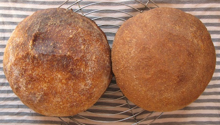
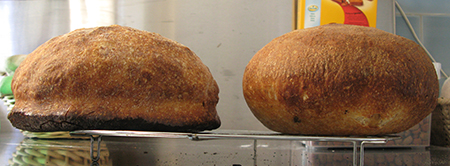

{.center}

Two identical loaves -- my basic part wholemeal sourdough -- had been retarded overnight in the fridge. They were brought out at the same time, and warmed up on the counter for about an hour. Then I had a madcap whim. Why not bake one under a [cold cloche](https://jeremycherfas.net/blog/everything-old-is-new-again-cold-start-cloche-baking/)? So I did just that, and after 22 mins, when I went to remove the cloche, had a mild panic. For one, the bottom of the loaf was burning rather badly. For another, the part baked loaf was stuck inside the cloche. A little violence shook it loose, and I quickly moved the oven rack and inserted a tray beneath it to reduce the risk of further burning. Out came the loaf, larger than anything I’ve ever baked before from that weight of dough. In went the other loaf, unslashed, no cloche. Out it came too, higher than anything I’ve ever seen. The difference in volume is really rather remarkable.

{.center}

No crumb shot, because the bread is still cooling down, and in any case one of them is for the client.

There’s a moral here somewhere, a lesson to be learned. It may be that I need to invest in one of those foil roasting trays and see whether that works as well as a steam trap as some people suggest. I’m pretty sure a flimsy foil tray, no matter how rigid, won’t do much for the crust, but it might just allow for greater oven spring and higher rise. Worth a try, at any rate.
