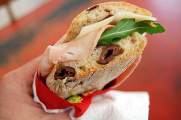

{.center}

> Since we met him about two and a half years ago, Paolo Cantele has become one of our best friends -- in part because we all laugh so hard when we’re together, in part because he shares my interest...

It is true that great sandwiches can be found even in the humblest places, and one of the fine things about Italy is that in many of those places, they would still rather have you wait while they prepare the sandwich fresh than have one ready and wrapped in case you want one. While the convenience and range of the ready-made sandwich around the world can be beckoning, the best sandwiches are so easily assembled that it seems foolish to sacrifice quality for convenience. Still, even here, the ready-made item is gaining traction. It is also true that few other countries would tolerate the average bar _trammezino_. Or would they?

Original article: [Best meals 2011: olive bread gas station epiphany](https://dobianchi.com/2011/12/24/best-meals-2011-olive-bread-gas-station-epiphany-paolocantele/)
