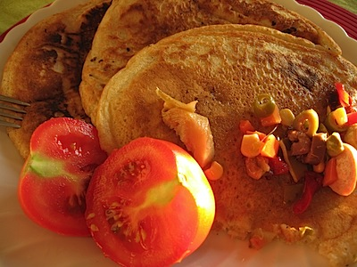

I’d been looking forward to this evening all week. (How sad is that?) It was time to bake, or at least to prepare loaves to bake tomorrow morning. I’ll deal with that tomorrow morning, when the bread comes out of the oven for judgement. For now, lets just say that it was very scary. And it ain’t over yet.

The question was, what to do with the leftover starter. In pursuing my sticky dough across the internets I had fallen into many a sourdough rabbit hole, plenty of which asked the same question. And they generally answered it with sourdough waffles or sourdough pancakes. That sounded like fun, but all the recipes I looked at seemed pretty complex, involving eggs and milk and extra flour and what-have-you, and most starting the night before you want pancakes or waffles for breakfast. Fie on that. I had a tub of what amounted to batter; what else could it need?

A teaspoon of salt, a teaspoon of bicarbonate of soda (which the recipes said reacted with the acid in the starter to give extra lift and fluffiness) and two tablespoons of olive oil.

Boy were they good.

{.center}

I realized, after I’d cooked them, that I didn't actually have any toppings to eat them with. No bacon. No maple syrup. But I did have a jar of Riso d’Estate, which is not actually summer rice but a diverse mix of vegetables (and, bizarrely, little slices of hot-dog sausage) in oil that you can put on cold rice to make Summer Rice. And some roast artichokes. And a couple of fresh tomatoes.

I went back to my notes, and worked out that I had begun with something like 450 grams of 100% hydrated starter. That resulted in four pancakes, which was about twice as many as I should have eaten. Bottom line: even if the bread doesn’t work out, the pancakes were worth it.
