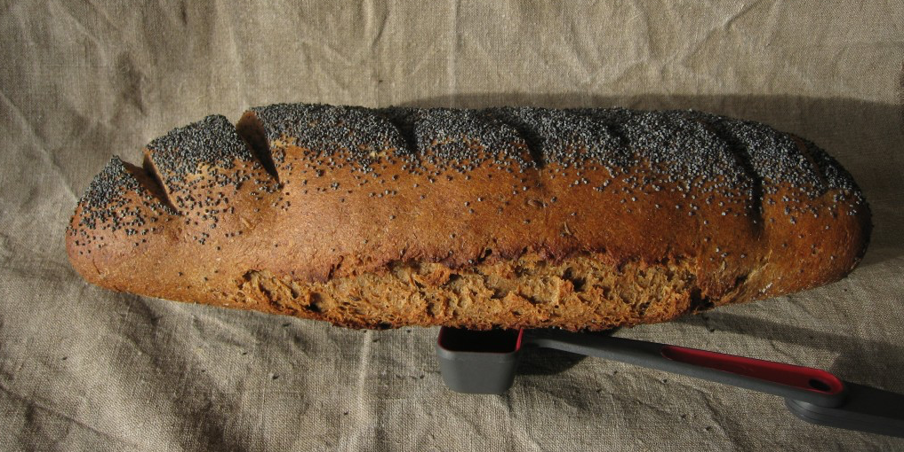

I wanted to have another go at [Dan Lepard's Black Pepper Rye](https://www.jeremycherfas.net/blog/dan-lepard-s-black-pepper-rye), making use of two new ideas. First, rather than attempt to control boiling the rye flour in the coffee, which gave lots of people trouble, I planned to just pour boiling coffee over the rye flour. Secondly, instead of dried yeast, I wanted to use my ordinary white-flour starter. Combined, these two offer an opportunity to practise (and attempt to explain) baker's math.

===

There are a couple of different approaches, but the one I like best simply treats ALL the flour in the recipe as 100%; every other quantity is calculated on the basis of the amount of flour. [^fn1] Quite apart from anything else, using baker's math allows one to scale recipes up and down with abandon. There are even online spreadsheets that do the math for you. Anyway, Dan's original recipe calls for a total of 475 gm flour (150 rye and 325 white) and 325 ml of coffee. So the percentage liquid is:

    325/475*100=68.4%


Instead of dried yeast I decided to use 100 gm of my white flour _levain_ starter, which I maintain at 100% hydration, so that adds 50 gm of flour and 50 gm of water. Usually when doing this kind of calculation, I subtract the flour in the starter from the total flour and the liquid from the liquid and recalculate the amount of water to maintain the original level of hydration, reducing the liquid accordingly. In this case, knowing that there can be liquidity issues with the recipe, I decided to keep the original 325 ml of coffee and to calculate the additional flour needed to bring the hydration down to 68%.

````
475+50=525 gm flour in total.  
325+50=375 ml liquid in total.  
375/x*100=68  
∴ x=375/.68=551 gm flour  
∴ Additional flour is 551-525=26 gm
````

So I need to add 26 gm additional flour to maintain the hydration of the original recipe. [^fn3] In the end, though, I needn't have bothered.

Pouring the boiling coffee, with its freight of crushed black pepper and whole caraway seeds, onto half the rye gave a consistency very like wallpaper glue. An hour later, when it had cooled, I added the 325 gm of flour, and the consistency was just about perfect. It took a bit of work to bring the dough together, but from then on, all was smooth sailing. So I didn't add any extra flour. But I could have ... and I knew how much.

{.center}

The bread was good, as good as the previous time, although it could perhaps have done with a little extra time to rise. That's how I interpret the explosion along the side. Unfortunately no amount of calculation can tell you how long a shaped loaf will need to prove "until it is enough," and I was on a schedule.

[^fn1]: [Some people](http://www.thefreshloaf.com/node/2358/bakers-math) call this "king" number because everything else has to bow to it, a concept I find objectionable on at least two grounds. :)  

[^fn3]: I wasn't going to go crazy and split that into 10 gm rye and 16 gm white, but I could have done; once you get the hang of baker's math, it's a cinch. 