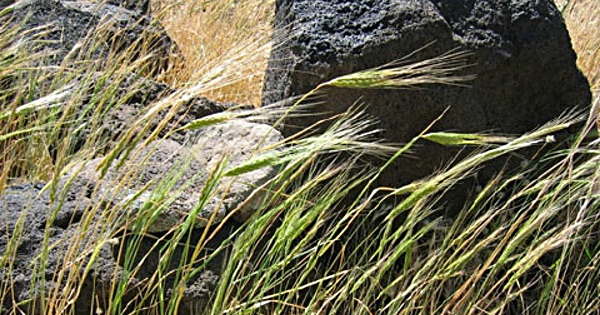

Over [on Mastodon](https://indieweb.social/@etp), I noted that [Juhis](https://mastodon.world/@hamatti), whom I follow, was getting fired up about the start of Blaugust. I had no idea what that was about, so had a quick look and discovered that it was a month-long celebration of blogging, the goal being to write a post a day for the whole of August. Ha! I thought, I’ve already done the exact same thing, for the [Dog Days of Podcasting](https://dogdaysofpodcasting.com), which is still going strong, although I’m not doing it this year.

{.center}

===

Podcasts, almost everyone acknowledges, suffer from a huge lack of serendipitous discovery. You simply cannot skim audio like you can an image or text; you have to listen. That takes time, and it seems nobody has time. Those tricksy tools that create moving waveforms and subtitles for a juicy bit of audio don’t help, at least in my experience, so all one can do is ask for ratings and reviews and hope that listeners will help spread the word. That does work, very slowly. What if I piggyback on Blaugust to link to the 32 episodes I posted back in August 2018? That would go beyond pure promotion, which I find very difficult, and would still put the work in front of people unlikely to have seen it before, some of whom might be encouraged to subscribe to the podcast of which this was a part.

Reading a bit more about Blaugust, I wasn’t sure that telling the story of bread and wheat would fit, but Juhis encouraged me, so here I am.

## An introduction

I’ve been making my own bread on and off since I was about 15 or 16, encouraged to do so [by my mother’s homemade bread](https://www.fornacalia.com/2013/100-wholemeal-sourdough/). For the past 20 years or so, almost every loaf has been raised by one of my two natural leavens, and I’ve been thrilled to supply bread to a set of friends who are actually willing to pay money for the stuff, the purest kind of validation.

At the same time, I am a biologist with a strong interest in the history of crops as well as the science of baking. And I make podcasts that use food to examine anything I want to find out about. Put all that together and you have my Dog Days series.

## Our Daily Bread

The episodes of Our Daily Bread are short, around five or six minutes, and scripted, rather than the longer interviews that I normally publish. Most of them need no updating, at least as far as I am aware, although if you know better please tell me. My plan is to use this site, the mother ship, as it were, to point to the day’s episode over at my podcast site, and I will syndicate from here to Mastodon. The rest of the posts are unlikely to be anything like as long as this because I will probably just copy the text I used first time around.

## Let’s Go: The Abundance of Nature

{.center}

In the 1960s, using the most primitive of tools, an American plant scientist demonstrated that a small family, working not all that hard for about three weeks, could gather enough wild cereal seeds to last them easily for a year or more. Jack Harlan’s experiments on the slopes of the Karacadağ mountains in Turkey offer a perfect gateway to this exploration of the history of bread and wheat.

<a href="https://www.eatthispodcast.com/our-daily-bread-01/" rel=canonical>Listen to The Abundance of Nature at Eat This Podcast.</a>

*Photo of Wild einkorn, wild emmer and Aegilops species in Karacadağ mountain range by H. Özkan.*