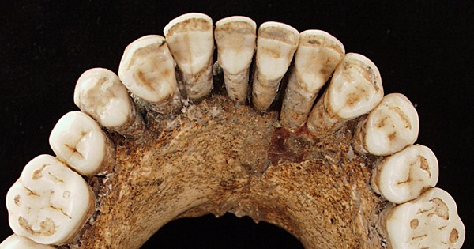

{.center}

When did people start to eat wheat? The date keeps getting pushed back, and is now around 35,000 to 45,000 years ago. That is long before the dawn of intentional agriculture. How do we know? Because a man who died in a cave hadn’t cleaned his teeth, and stuck in the tartar were grains of boiled starch. Which raises another set of problems that seem to have been solved by wilderness survival experts.

<a href="https://www.eatthispodcast.com/our-daily-bread-02/" rel=canonical>Listen to Boil in the Bag at Eat This Podcast.</a>
