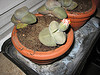
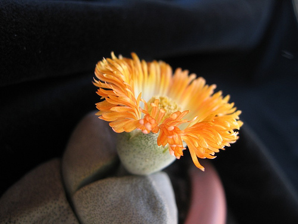

{.left} Thrilled, on returning from hospital, by this bud on my Lithops, I had been waiting for it to open fully. Morning, before work, and evening, after, I checked it; no change. But this afternoon, before my nap, there it was, fully open.

{.center}

I should have known (or guessed) there might be a circadian element to it.

~~It has taken far too long to get this entry looking right and it still doesn’t. I obviously need to do some serious work on the template. But that will require fully operational fingers.~~
