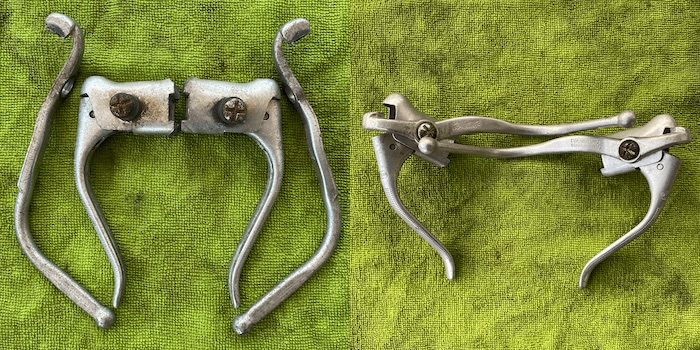
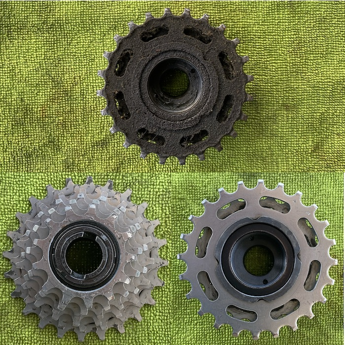

Getting close now to the end of the component cleanup phase on the old bike.

===

The brake levers were remarkably easy to take apart and responded well to a little warm soapy water and a bit of elbow grease. I toyed with the idea of jettisoning the suicide extenders, as many people call them, but they were never a problem for me, probably because I never go all that fast so that I don’t have time to shift to the levers proper if I need to stop in a hurry. Just ambling along, the extenders are a comfortable way to slow down a bit. My question now is whether to add new brake lever hoods.

{.center}

The bike never had hoods originally, but that need not be an impediment; this is a thorough make-it-rideable not a loving-restoration. But then, what are brake hoods actually **for**? Comfort? Protection? Something else? I have asked, and the answer may determine my decision.

The final big bit of cleanup is the freewheel. I sprang for the proper Park Tool removal thingy (FR-2) but there was no way in heaven I could actually loosen the bloody thing. After trying various pointless ideas, I took the wheel down to the local motorcycle mechanic shop. The place is like an operating theatre, absolutely spotless, terminally neat. The young man who first offered to help was a bit confused, I think, using a pretty puny spanner and, initially, going the wrong way.

I said, it needs a lot of force, and it goes the other way.

At which point an older gent appeared, grabbed a much heftier ring spanner, slipped it over the tool and gave it an almighty thump with his fist — anticlockwise. Bingo! I came home and passed a pleasant 90 minutes or so diligently going at 40 years of encrusted debris with toothpicks and a lovely strong scraper that The Squeeze bought years ago. (Dental tools might be a useful addition to my resources.) A bit of flossing with fabric and the whole thing is mostly clean.

{.center}

So, that leaves the axle bearings, front and back, still to be cleaned. And then the frame itself, which needs rust converter, primer and final black and clear coats. So far, though, I have not found a source of car paint, though I came close yesterday.
