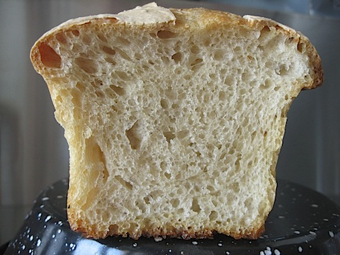

First thing I did on getting back from hols was to wake the sleeping sourdough and then set to. I was determined to produce a better loaf, despite the heat: over 30℃ in the kitchen by day, and nowhere else much cooler. Step one was to find a stronger flour. I’d always used Barilla 00, which is about 9% protein, because that’s what there was. And it worked fine during cooler weather. Now I needed something stronger. When I looked, there were two types of flour from Manitoba on the shelves, one at 12% and one at 13%. I went for the latter.

What a difference. I didn’t bother to photograph the dough, because it was just about what I was expecting. A bit sticky, perhaps, but that probably had more to do with the fact that I stretched and folded rather than kneading. And the spiffy new silicone coated scraper I scored at Sur la Table was really good. A useful tool.

The details. Starter at 100%, built with 9% flour to make 20% of the batch. Batch based on 1 kg total flour, and 60% hydration. So that’s a total finished weight of 1600 gm. Made of 320 gm starter, 440 gm (600-160) water, 840 gm (1000-160) flour and 1 tsp salt. Stretched and folded every 30 minutes or so for 4¼ hours at about 30℃, by which time it had doubled.

I halved the batch, roughly shaped the dough and bunged it into lightly oiled tins. Those went into the fridge, which I think is at about 12℃, although that seems on the warm side. [^fn1] Proving for about 18 hours, and again the dough had roughly doubled. I took them out of the fridge and left them for roughly an hour, during which time they rose a little more. Uncovered in the fridge the top surface had definitely dried out, but there was no alternative. I slashed the crust carefully, and put one loaf into the oven at 250℃ under a big old cast iron casserole. No steam though. Getting steam in under the casserole is a trick that escapes me right now. After 20 minutes I took the casserole off and reduced the heat to 205℃, leaving it another 30 minutes. Inside temperature was 95℃ when I took it out to cool. And boy, did it look good.

{.center}

Good structure too.

{.center}

The proof, of course, is in the eating. With a fresh goats cheese. Excellent. I may have solved my problem, although I’m tempted to do a proper knead next time, just to see whether that makes a difference.

There’s only room under the casserole for one loaf,, so as an experiment I did the second without a cover. The big difference was the look of the crust. Less glossy.

[^fn1]: It is! I did a quick check, and it seems I should aim for 3℃. Not that there's been a major problem with spoilage. 
