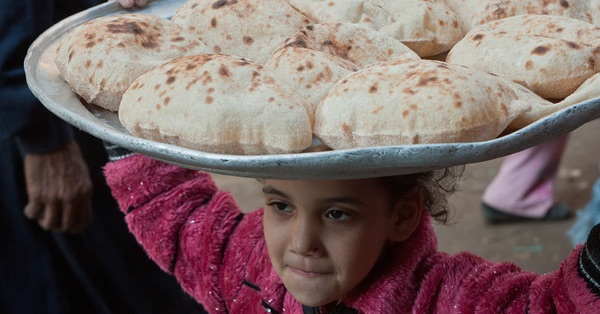

{.center}

An enormous amount of wheat, roughly one fifth of the total harvest, is traded internationally between countries and, as might be expected, if the supply falls, prices rise. Given the strategic importance of wheat, countries try to ensure that they have an adequate supply, even when doing so actually makes things worse, at least in the short term.

Wheat links a drought in China to the fall of Egypt’s government in the Arab Spring of 2011.

<a href="https://www.eatthispodcast.com/our-daily-bread-27/" rel=canonical>Listen to Bread and Political Circuses at Eat This Podcast.</a>