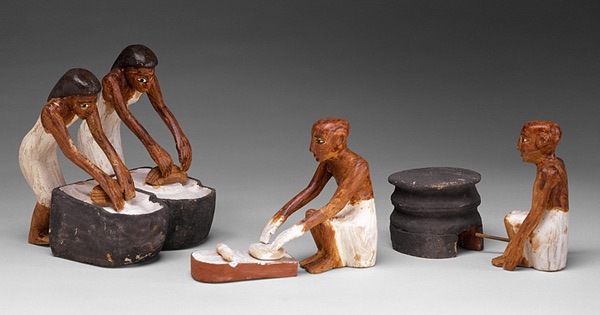

{.center}

It’s a good thing the Egyptians believed strongly in an afterlife and wanted to make sure their dead had an ample supply of bread. The bread and the tomb inscriptions tell us something about how grain was grown and bread baked. To really understand the process, however, you need to be a practical-minded archaeologist like Delwen Samuel, who first set out to replicate Egyptian bread.

<a href="https://www.eatthispodcast.com/our-daily-bread-13/" rel=canonical>Listen to Bread from the Dead at Eat This Podcast.</a>