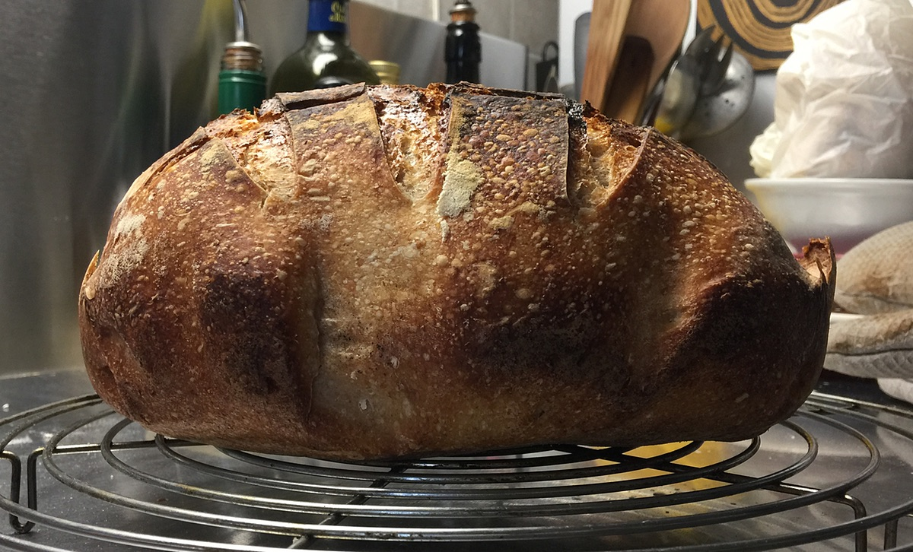

I have a website dedicated to my bread-baking efforts, but I've never seen the point of posting every time I bake a bread that I've baked many times before. So it can seem a bit abandoned, between new breads. Today, though, I wrote about a new approach that worked wonderfully well for me this past weekend. It's a version of the no-knead style pioneered by Suzanne Dunaway and popularised by Mark Bittman and Jim Lahey. 

{.center}

It is based on Yohan Ferrant's do-nothing bread, as outlined in a book called *Respectus Panis*, written by a group of bakers called Les Ambassadeurs du Pain. You can read about it on <a class="u-in-reply-to" href="https://www.fornacalia.com/2019/respect-to-respectus-panis/" >fornacalia.com</a >.