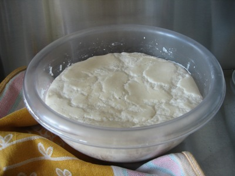
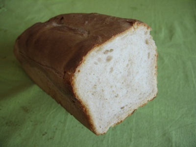

Although I promised to, I never did deal with the baking session that produced, as a byproduct, the [Best. Pancakes. Evah](https://jeremycherfas.net/blog/best-pancakes-evah/). Probably because it was too awful to revisit. The dough -- supposedly 65% hydration -- had absolutely no structure.

{.center}

Really, only a vague dread of wasting food persuaded me to pour it into the tins and hope for the best. But I’m glad I did, because the bread turned out to be not so bad at all.

{.center}

In fact, I took a loaf on a house visit to the country and it vanished pretty darned quickly. But oh, the trauma. So I kept reading and investigating, and decided that I definitely needed a stronger flour and a cooler (or shorter, which is difficult during the week) rise.
