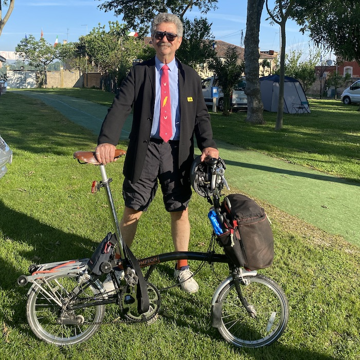

The kind of mad jaunt that appeals to me is an organised ride, on my Brompton, with a bunch of Italian Brompton enthusiasts, to the Brompton World Championships in Mestre, on the mainland just next to Venice. And I did just that two weekends ago.[^3]

[^3]: Yeah, I know, not the swiftest report. I had other fish to fry.

===

There’s this tradition in Italy called the _ponte_ or bridge. When a public holiday falls on a Thursday or a Tuesday, it is completely normal for people to also take the Friday or Monday off and make a long weekend of it. And when the holiday is on a Wednesday, the bridge has two spans and covers nine days. This year, Mayday was on a Wednesday, but I crossed only the second span.

## Day One: Thursday — Rome to Treviso
I was up early to cycle the 6.25 km to the main train station. As I’ve moaned before, I live at the top of a hill. The station is at the top of another. The ride, however, wasn’t nearly as strenuous as I thought it would be, probably because I was high on adrenalin.

At the station it was impossible to miss my companions, all with their Bromptons and encumbered with a variety of bags. Notably I and another Brit were the only two wearing shorts and also carrying much less than anyone else.[^1] When the platform was announced we wheeled our way to where the numbered carriages were helpfully signposted. I was in car 10 (of 12). Everybody folded their bicycles, hoisted their bags and waited for the train to trundle in.

[^1]: Because I wanted to travel as lightly as possible I didn’t bring any extra electronics beside my phone and backup battery pack, although leaving my Shokz behind was an error. That’s partly why this post is late.

First mishap. The helpful numbering was backwards. Car 10 sailed by, heading for the opposite end of the platform. No point unfolding the bicycle, so I just legged it back to where I’d started only to discover ...

Second mishap. A vast horde of young teenagers on a school outing, one of whom was sitting in my carefully reserved window seat. Of course, I had failed to reserve a seat in the quiet car. The noise they made was beyond belief, and I’m certain that not even the forgotten Shokz would have been able to block it. Every now and then a hapless teacher would attempt to reason with the kids, who would quieten down for all of half a minute. It reminded me mostly of the swell of noise and silence in the [Sistine Chapel](https://www.jeremycherfas.net/blog/coming-clean-about-the-sistine) and endured all the way to Mestre.

From Mestre a short ride on a regional train brought us to Treviso, where we were to spend the night. It was raining quite hard, so we each spent some time fishing out waterproofs and clambering into them, some more completely than others. I had only a jacket and I’m sure my legs dried faster than their trousers.

The hostel was a short way outside town, hard by a large elevated motorway but completely double glazed and quiet within. Relentlessly cheerful shades of yellow and orange and strange typography conveyed a general sense of corporate grooviness for young nomads. Frozen meals could be bought and heated in the communal microwaves and the dormitory was sufficiently comfortable that I had a lovely nap.

In the evening a local Bromptonaut arrived to take us for a ride around the city and explain bits of its history before leading us to a superb local trattoria, L’Oca Bianca, where we feasted on gnocchi with a duck ràgu and then delicious rabbit. After a long day, it would have been nice to have left a little earlier, but with all the bikes chained together, simply impossible. And to tell the truth, riding home in a large group through almost empty streets was a magic of its own.

## Day Two: Friday — Treviso to Lido di Venezia
Big day ahead and, alas, breakfast was no better than lunch had been yesterday. I chomped on my first energy bar ever, which was a slightly odd experience as it didn’t really feel like food or taste like candy, but it did the trick and I knew that there would almost certainly be a stop for coffee sooner rather than later.

There was, more or less at the start of the really pleasant part of the ride, alongside the river Sile. The cycle path makes use of the old towpath, for the horses (I presume) that pulled barges connecting Treviso and the Venetian lagoon, and it was an absolute joy to ride. Parts ran right by the river, others a little way away through tunnels of greenery with birds singing on both sides. No gradient to speak of, so as the kilometres rolled away the legs remained fine even as the bum became more and more tender.

There was a long and leisurely lunch and then a long and leisurely pedal alongside the lagoon where I saw swans, cormorants, a little grebe and swifts or swallows hawking low over the grass and reeds. Some of that path is on a kind of causeway out over the water, a boardwalk that made for some interesting noises as the massed wheels rolled along. Eventually, after about 10:26 hours, and 83 km[^2] we reached Punta Sabbioni, from which a ferry would take us to the Lido proper.

[^2]: This was according to Overland, which I use to record trips. I was also using the Outdoor Cycle workout on my watch, pausing it during stops, to try and get a better record of average speed, but that proved to be a bust because I sometimes forgot to resume recording after a stop and equally forgot to pause sometimes. Later I learned how to enable automatic pause, which I hope is more reliable than I am.

Without a doubt the hardest part of the entire day way getting back on the saddle after the ferry trip to cycle the 2.5 km to the campground. Even that, though, passed relatively quickly, and the exhilaration of the small climb over a canal and delicious descent afterwards was a bonus.

The campground was a campground. Some RVs parked up, some tents pitched, and some mobile homes for us to occupy. Each slept four, if you put two in a double bed. I was taught how Italians decide these things and miraculously won the double bed for the first night. The mosquitoes were numerous and ferocious, and of course bug spray was something else I had forgotten. We hung around for a bit while some people showered (!) and then back in the saddle again for a short ride to a restaurant. The less said about that, the better. Somehow we stowed four grown men, their Bromptons and their baggage in the tiny space and I fell into my hard-won bed.

## Day Three: Saturday — Venice
{.center}

Didn’t wake till 8:00, even though at some point one of my room-mates had come in to retrieve his bike. Bliss. The day was a free day, and although some people opted to go to a bicycling event that offered talks, films etc. on the mainland, I figured I would have a nice time swanning around Venice. The Art Biennale started a couple of weeks ago and I could see from the ferry that the place was packed but the nice thing about Venice is that it is always possible to move away from the main routes and find yourself almost alone, so that’s what I mostly did.

I did wander into two shows. The official entry of Côte d’Ivoire was called [The Blue Note](https://www.veniceartfactory.org/pagina-mostre/the-blue-note-%2F%2F-côte-d’ivoire-national-pavilion) and was done up to reflect a kind of nightblub vibe and the idea that despite enslavement and forced migration, people from West Africa carried the seeds of the blues and jazz with them. It was pretty cool. The nightclub also offered some stunningly good chocolate, which may be inappropriate but was nevertheless very welcome. 

The other show, nearby, was a collateral event called [Passengers in Transit](https://news.artnet.com/art-world/passengers-in-transit-193-gallery-venice-2461915). Colours popped and the monochrome images too were arresting. The locale was fascinating too, an old pharmacy with a mezzanine balcony that gave a great view onto the show below and out onto the nearby canal and passersby.

That was enough art and I was getting hungry, so I sought out a _chichetti_ bar I had been to a few times before and got there just before the crowds. Three delicious little snacks, a small draft beer and an hour in the shade made for a perfect restorative rest. On next to the Natural History Museum, which was really rather fine, a good mix of modern museumology and good old-fashioned cabinets of diversity, and almost empty as an extra treat.

From there I walked a long way round to a gelateria recommended by a social friend, which surprised but did not disappoint. The *gianduiotto* is a block of chocolate and hazelnut ice cream served in a cup with a wodge of whipped cream below and a wodge of whipped cream above. I don’t normally care for whipped cream with gelato — why gild the lily? — but that’s the way they come, and my friend said it was worth crossing town for, which I just had, so no argument. I retired to a nearby bridge to sit and clog my arteries in silence.

Vaporetto back to the Lido, long walk back to the campground, nap, lots of hanging around swatting mosquitoes and cleaning bikes for the big day tomorrow and finally a bunch of us rode off to a dinner that made up for yesterday’s. I had the *fegato alla Veneziana* I love, and it was excellent. Back at the campground, my room-mates did me the singular honour of letting me stay in the double bed as a mark of respect for my advanced years, the bastards.

## Day Four: Sunday — Brompton World Championships
The Big Day, with everybody gussied up to a greater or lesser extent. I was surprised to see not one but two Italian men in a kilt, and though one was a cheap Chinese fancy-dress knockoff, the other was genuine enough. Black jacket and pink tie was the best I could manage, but it did win “best tie” when we got our numbers.

That was after a glorious ferry ride to Tronchetto and then along the causeway — on a separate cycle track — to Mestre. That was a lot of fun, cool enough weather and somehow both modern, with high-speed trains whizzing alongside us, and ancient, making the connection between lagoon and mainland by muscle power. We got a bit lost finding the park, no thanks to a very poorly announced deviation due to works on the normal cycle path, but made it in time to get our numbers and then do a lot of waiting. There were some interesting stalls; Brooks gear, fancy racing shoes, Schwalbe tires and some trinkets made from recycled tires and other stuff. Nothing I absolutely had to have, which was slightly disappointing as I had hoped to find a nice small auxiliary bag. Lots of photo ops during the milling around, of course.

The race was a lot of fun. We lined up our folded bicycles along one side of the paved path without knowing where the start would be. Turned out it was at the end of the line rather than opposite the bikes, so some people had quite a way to run for the Le Mans start. Confusion reigned, but I managed to find my bike and get going. We did a small circuit to get onto the proper race course, five laps of three km each. Marshalls and tape blocked off the route and zipping through the curves without slipping on loose gravel was extremely exhilarating. 

At least around me, the order of precedence settled down very quickly. I overtook a few people. A few people overtook me. Then we all just peddled like mad, surprised as all get out when the leaders zipped by to lap us in tight bunch. A small hill on the otherwise flat course was a nasty surprise and though I managed it without slowing down too much on the first and second laps, by the third and fourth it was an obstacle to be dreaded and overcome.

Coming into the home straight on the fourth lap another nasty surprise emerged. A marshall flagged us down and told us to stop, and an ambulance set off round the course. Apparently someone had taken a tumble, though we never did find out how serious it had been, and because the winners had already completed the course we were not allowed to continue. That meant we didn’t get final times. Still, my watch said I had averaged slightly more than 22 kph, which isn’t bad for an old geezer with no training.

More hanging around and standing in a line for the free lunch, which was delicious, and an inexpensive beer, ditto. Prizes were given, politicians spoke about European cycleways, the sun was warm and people were friendly. I looked around and discovered that the rest of my chums had left. Fair enough; people were departing on a variety of trains so it was up to each person to sort their own departure. Still, I did feel a tad abandoned. The good part was that at some point after the race I checked my emails — I still don’t know why — and discovered an offer from Trenitalia to upgrade to business class for 6€. Done deal!

Off to the station, not a difficult ride, though without headphones and hearing aids, hard to follow instructions. That helped me decide that I ought perhaps to invest in a Quadlock for the phone, though there is precious little room on the Brompton bars. I need to check whether the handlebar bridges one can buy will fit an ancient model like mine.

My chums seemed pleased, though not surprised, to see me. There was some anxiety over whether a strike would affect our train, but it didn’t and so I lolled in a comfy leather chair in a lovely quiet carriage all the way back to Rome, too tired to read anything, unable to listen to anything, just gazing out the window at the scenery grazed by the golden light of the setting sun.

Bus home. No worries. Splendid adventure, to be repeated.

