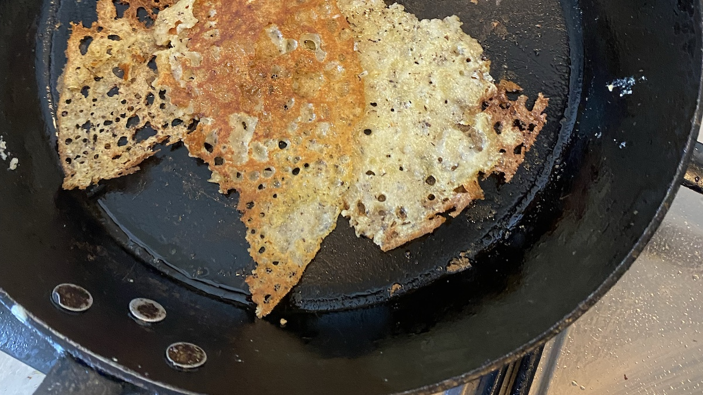

It’s hard for me to admit that I can’t make something in the kitchen, but I have had to come to terms with the fact that I am simply incapable of making a straightforward _galette sarrasin_. I adore buckwheat in bread and as _kasha_ and, when someone else makes them, as buckwheat pancakes, but I simply cannot get the hang of them.

===

For a start, most of the recipes online are for anything between 10 and 15 galettes, using 300 to 500 gm of buckwheat flour, far too much for us. Then there’s the question of all milk, all water, or a mixture. And finally, some call for an egg, others don’t, and some say the egg is optional.

A while ago I looked at a bunch of recipes and worked out what I thought was a suitable ratio: 1:2.25 flour to liquid and 4% salt (i.e. 170 gm liquid and 3 gm salt for 75 gm flour). That proved to be very thick, took far too long to cook through and was impossible to fold neatly.

A chef I follow used a different recipe that I tracked down, which mixed in 25% wheat flour and 1:4 total flour to liquid, with an egg.

That proved absolutely disastrous, with no structural integrity at all. It felt apart at the lightest touch of a spatula and was impossible to rescue.

At this point I could, as a bad workman, blame my tools. My frying pan, as you can see, has quite a steep side, which makes sliding the spatula under the pancake a bit difficult. Perhaps a proper low-sided crêpe pan would be better, but that is an expense too far.

Then there’s the buckwheat flour itself. Mine is whole, not refined, but none of the French recipes I looked at specify. One refers separately to *farine de sarrasin* and *farine de blé noir* but my understanding is that both mean “buckwheat flour” without one being refined and the other whole. Still, I could try refined flour next time.

And there will be a next time because, as I say, I adore buckwheat and I will not be beaten. Clearly the thing to do is to adjust the amount of liquid, keeping flour constant at 75 gm for two galettes. If 170 gm liquid is too stiff and 400 gm too liquid, next attempt must be 285 gm, right?

The good part, of course, is that even if I can’t make a proper galette, I can eat the disasters.

{.center}