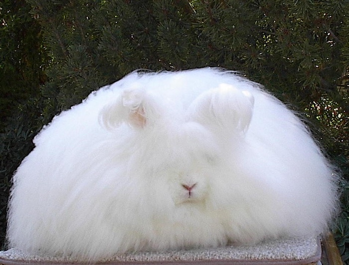

{.center}

The blog equivalent of a nice cold shower to cool the brain after last night's fevered rant. [Dunstan](https://www.1976design.com/blog/archive/blogmarks/2004/01/08/rabbits/)'s wonderful and newly-designed blog sent me in search of what he called [Wabbits](https://web.archive.org/web/20040202012640/http://home.pacbell.net/bettychu/2003allbreedbisris/BIS.html), childish lout. And there they were, fuzzy mutant wonders. Betty Chu, “Breeder of the _only_  Angora rabbit who ever won the **Open Best in Show** in the ARBA (American Rabbit Breeder Association) National Convention,” says her pages are copyright 2003. I hope she won’t mind me showing one of her glorious animals here.

But how on Earth did Dunstan find them?
