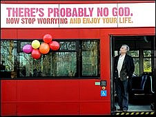

{.left} Is First Bus the most pusillanimous company in the UK? [Probably not, but it is up there](http://news.bbc.co.uk/2/hi/uk_news/england/hampshire/7832647.stm).

> A Christian bus driver has refused to drive a bus with an atheist slogan proclaiming “There’s probably no God”.

> Ron Heather, from Southampton, Hampshire, responded with “shock” and “horror” at the message and walked out of his shift on Saturday in protest.  

> First Bus said it would do everything in its power to ensure Mr Heather does not have to drive the buses.  

What would happen if the bus advertised, say, racial tolerance, and Mr Heather were a member of the BNP?

[Via PZ](https://web.archive.org/web/20090323071428/http://scienceblogs.com/pharyngula/2009/01/maybe_he_has_a_phd_in_philosop.php), who rather goes to town on this one. I’m not sure I have the energy to follow the [godless bus sagas](http://jeremycherfas.net/blog/another-fine-twofer/) as they unfold -- [even in Canada](https://web.archive.org/web/20090119075331/http://atheistbus.ca/) -- but this one was too good to pass up.
