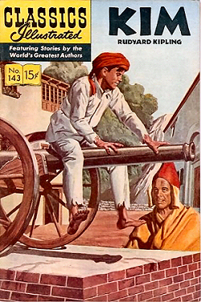
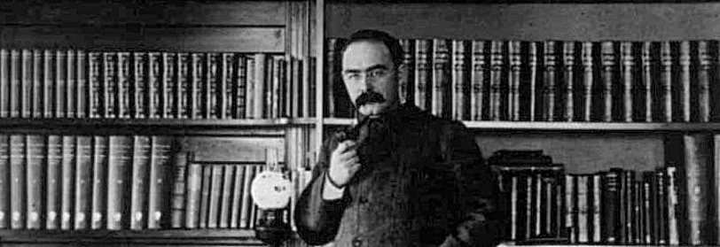

I've been on a bit of a Kipling jag lately, first Kim and then The Man Who Would Be King. Both are very definitely of their time and of their author and raise the perennial question of judging the art or the artist. 

As far as Kipling goes, this is by no means a novel question. He's been blackballed and readmitted many, many times by people much cleverer than I could ever hope to be.[^1] I chanced upon one such assessment in a foreword to a collection of The Man Who Would be King and Without Benefit of Clergy.[^2] On the one hand, it sees Kipling as 

===

> a sort of propagandist--first, of the "white man's burden," of imperial rule in general as against that principle which we have lately learned to call "the self-determination of peoples"; secondly and specifically, of British imperialism against all other.

Against that is the view that

> however much he may have written *about* British imperialism, it is not really part of his function to write *for* it; that, if the artist be sensitive enough to life, it makes no conceivable difference what special aspects of life happen to have come under his notice.

I'm definitely inclined to place Kipling the writer above Kipling the man, knowing, actually, little of either. I do know that the stories are illuminating and interesting precisely for offering a window into the thought processes and mores of the times and places he wrote about. And I'm very glad to have come to them later in life, when I am able to see a bit more than when I originally read The Jungle Book, Kim and, especially Just So Stories.

{.left} Kim, for example, contains all the spiritual thoughts and discussions that I'm sure were not included in the Classics Illustrated edition I believe I read. (Not surprising, really, given that Teshoo Lama looks young enough to be Kim's older brother rather than close to the end of his life.) There's far more of that than there is the details of spying, and I'm not sure how appealling most children would find the book in full.

The Man Who Would Be King, likewise, has several passages that do nothing to advance the story. The narrator, a journalist like Kipling himself, waiting until the very last minute to go to print just in case something happens half a world away tells us something about the position of India, but nothing about the two main characters. 

Having read Kipling's tale, which is really rather spare in its treatment of the story, I admitted to The Main Squeeze that I had not seen the Caine Connery extravaganza, so that was on the entertainment menu last night, and extravagant it certainly was. I was particularly interested in seeing how the film would open up the the bigger part, when Peachey relates what happened to him and Dravot. I thought it very well done. Of course liberties were taken; Billy Fish is absolutely necessary as a translator rather than a mere resemblance, given that Peachey is no longer narrating most of the story (although what, actually, the locals were saying remains a mystery). And the Masonic stuff has to be jiggled about a bit. But by and large I thought the screenplay worked really well. The film is dated, and very "epic," but that rather suits the original. 

What's next? Maybe a bit of Rider Haggard?

{.center} 

As for Kipling, seen above in the study of his house [Naulaka in Vermont](https://landmarktrustusa.org/properties/rudyard-kiplings-naulakha/), he's a pore beknighted Anglo and a first-class writin' man.

[^1]: The great shame in all this rediscovery is that while Kipling himself is long since out of copyright and freely available, many of the volumes that include interesting criticism are not.

[^2]: Wilson Follett's Foreword to an [edition by the International Pocket Library, Boston](https://babel.hathitrust.org/cgi/pt?id=iau.31858006894483&view=1up&seq=5). And chasing him down led to an [amazingly interesting story about Follett's daughter, Barbara](https://web.archive.org/web/20140802030812/http://www.laphamsquarterly.org/essays/vanishing-act.php?page=all).