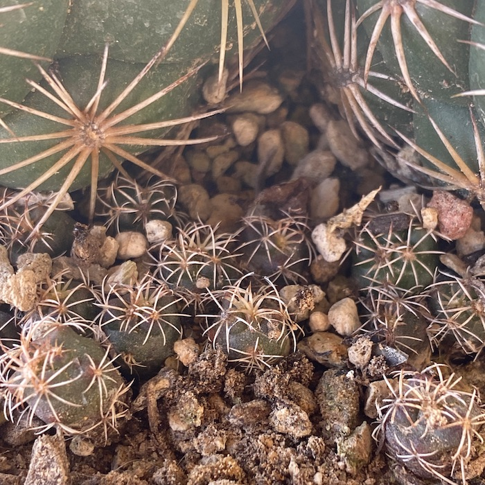
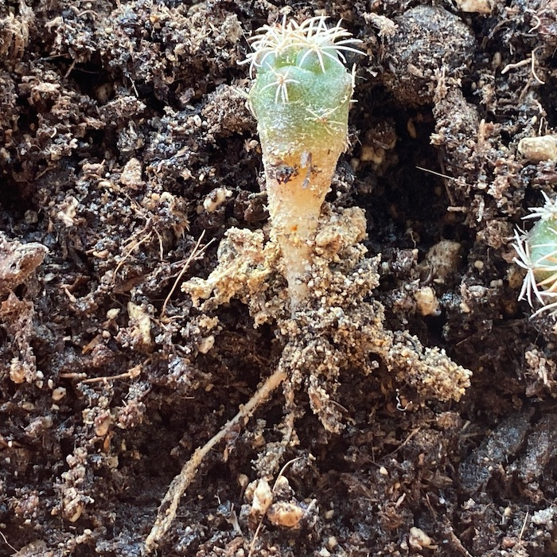
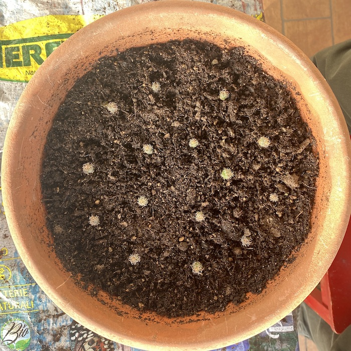
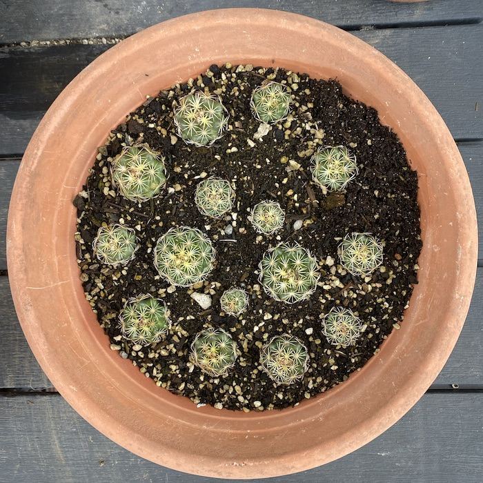
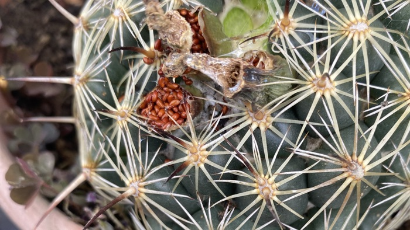

Our terrace is a constant source of joy, let me be upfront about that before I move to its failings, just one of which is that the space is so finite. In an actual garden, there’s always room to cram in one more plant. On a terrace, not so much, which inevitably creates trouble when there are excess plants which, at this time of the year, is the result of potting on and thinning out. Some we leave by the garbage and usually they are gone in a matter of hours, which is nice. Others we give away. Yet others, we cram in. None of which detracts one bit from the even greater joy of seeds.

===

About a year ago, I noticed that one of the cacti had what looked very much like seedlings; not offshots, because they seemed independent and too far from the parent plant.

{.center}

I prised one up, and sure enough, it was a seedling, with roots and all.

{.center}

And so, despite knowing that I would never have space for all the resulting plants, I extracted as many as I could and planted them out, resulting in two pots with well-spaced plantlets. This is the larger.

{.center}

A year on, my how they’ve grown! I’m about ready to chuck their cheeks and tousle their hair.

{.center}

Not sure yet whether I will pot them on and face the trauma of having to find them homes, or leave them for another year and delay the horror.

Most of my cacti flower from time to time although none of the others sets seed, as far as I can tell. And yet, this one is doing it again.

{.center}

I’m not deliberately sowing those, but you never know.

! *p.s.* The plant may be *Coryphantha cornifera*; then again, it may not.
