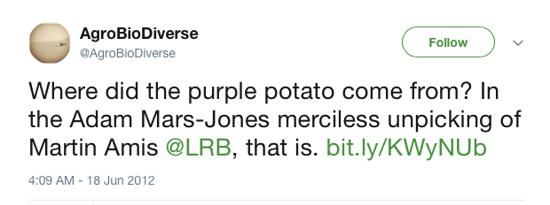

Adam Mars Jones, a well known author, [writes the following](https://www.lrb.co.uk/v34/n12/adam-mars-jones/anti-dad) in the course of eviscerating Martin Amis, another well-known author:

> The same sense of lostness clings to social attitudes. When Des finds a girlfriend, Dawn, the only problem is her racist father, Horace. He’s not just a racist but a throwback of a racist: ‘Your brain’s smaller and a different shape. Whilst hers is normal, yours is closer to a primate’s.’ In the allotment of nasty social attitudes this contorted purple tuber must count as a heritage potato, miraculously re-established from a seed bank.

{.center} 

It is just such a bizarre metaphor; where did it come from, and what does Mr Mars Jones intend by it?