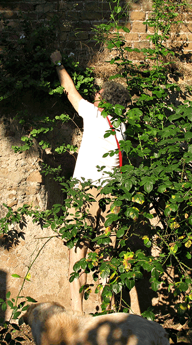

{.center}

People who know only little jars of vinegary green balls, or salt-packed sachets, are often surprised by caper flowers. Delicate, exotic, with those gorgeous anther filaments shading from purple to white, they seem out of place on the wild capers that tumble down rocky cliffs. And flowers mean you're either too late for capers or too early for caper berries. There are no sun-baked rocky cliffs around here, but as far as the capers themselves are concerned, the ancient walls of the Villa Sciarra are a perfect substitute.

{.center}

{.center}

And so it was, early one morning last week, that I set off to start another crazed attempt at home food processing. We walk along the wall two or three times a day, between the straggly roses and tall cypresses, and noticed the first caper flowers about 10 days ago. They are so eye catching that it is easy to overlook the tiny buds from which they explode. It is those buds that become capers, the tinier the better. 

For me, they're relatively easy to reach, and I quickly developed a technique of nipping the bud stalk with my thumbnail and then nipping it again just below the bud to discard the stalk. It isn't a particularly pleasant exercise; many of the buds are sticky with aphid honeydew, and while the ants that are always in attendance don't bite, they do make me itch. The early morning peace and quiet, and the quietly filling plastic tub, compensate, and the dog resigned herself to a walk of fits and starts.

It took about half an hour to traverse the cliff, at the end of which we had what proved later to be 96 gm of caper-flower buds. But not yet capers. That's where the processing comes in, and boy do they need it. Just for fun, in a spirit of adventure, I tasted one *au nature*. Gack! Very bitter, very tannic, very nasty. 

{.center}

Capers exemplify two problems in the history of human diet: what on earth made people think that something so unpalatable could become delicious? And how on earth did they discover the process? Some, obviously, could be the result of trial and error, but the rest, capers included, occasionally prompt me to agree that advanced civilisations, vastly superior to our own, came as gods and gave us the secrets of capers, and olives, and *fugu*, and cassava, and whisky, and *hákarl*, and ... you get the picture. Back to my incipient capers.

Pickling in vinegar or salting are the two favoured processing methods, with salting being more authentic and simpler: add salt, drain, add more salt, stop when there is nothing left to drain.

{.center}{.center}

So that's where we are now. They've been sitting in salt for nearly four days, and they are beginning to look a lot like "proper" capers. As I drained them this morning, I decided to taste one. Gack! Very bitter, very tannic, very nasty. Time will tell.

{.center}
