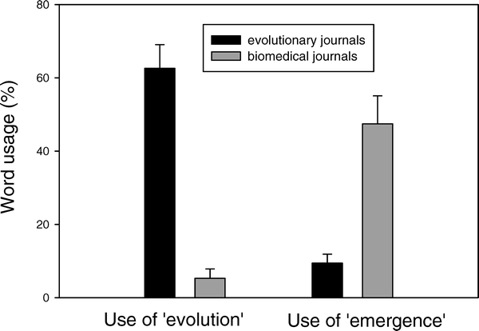

{.center}

Medical doctors avoid the e-word when describing their research on the evolution of antibiotic resistance. But science writers are no better; whether they use the e-word depends on whether the original paper they are reporting used it.

A fascinating essay from Janis Antonovics and colleagues at the University of Virginia, Charlottesville, and published in [PLOS Biology](https://journals.plos.org/plosbiology/article?id=10.1371/journal.pbio.0050030), compares the words used to describe antibiotic resistance in evolutionary journals with medical journals. And they bend over backwards to give medics the benefits of the doubt. But my gut feeling is that lots of physicians actually do not believe that the evolution of antibiotic resistance is an example of natural selection at work. I’m always shocked by the number of medical doctors that profess [not to believe in evolution](https://web.archive.org/web/20060509002124/http://www.jtsa.edu/research/finkelstein/surveys/evolution_results.shtml).[^1] And I reckon that for them, as for many other weasels, the spread of antibiotic resistance is not evolution because it does not involve one species turning into another.

Two interesting asides. The Antonovics paper dismisses the old canard about the funding agencies (in the US) avoiding the e-word. There has been a steady increase in the use of “evolution” in the title of NSF and NIH awards.  And, perhaps counter-intuitively, there has been a steeper rise in the use of the word in the titles of papers in general scientific and medical journals than in evolutionary journals. Say the authors:

> This reflects the growing importance of evolutionary concepts in the biomedical field, and highlights even more the strange rarity with which the word “evolution” is used in the biomedical literature dealing with antimicrobial resistance.

The real point is that the spread of antibiotic resistance is a life-threateneing phenomenon. Maybe, if people heard the word “evolution” more often in connection with something that really matters to them -- like being two to three times more likely to die in hospital -- they’d begin to accept the truth of the theory.

[^1]: What's nice about the [Google search](https://www.google.com/search?q=doctors%20believe%20evolution&sourceid=mozilla2&ie=utf-8&oe=utf-8) is how people are shocked one way or the other. "It's a scandal. 34% of doctors don't believe in evolution" "It's a scandal. 63% of doctors reject God." Me, I'm worried by the 3% who have no opinion. What is their practice based on?
