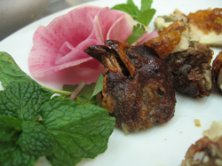

{.left} This always happens. One busy day and all thoughts of keeping on top of the blogging vanish. So yesterday was the first full day of exposure to Chinese food (in between work). And I have not yet processed or uploaded the photographs. Nor, actually, do I have anything like a full list of everything we ate, not least because our hosts were often at a loss to render a dish’s name in English. But it was a total delight.

Lunch took place after a field visit to rice farmers, at a large shed of a place near the Stone Forest. We were ushered into an upstairs room where round tables with Lazy Susans awaited. So far, so conventional. Then the food started to arrive. And the drink; [buckwheat fire-water](1437779277.jpg), as good a use of a neglected species as any.  It was only 24 hours ago, and yet I cannot remember the individual dishes, not least because of that name problem. There were loads of different kinds of fungi, including one very meaty sort laced with hot chillies and another much slimier kind with slow-cooked soft garlic that mingled sweet and sharp most attractively. Shrimp with green leaves that turned out to be tea. Another  first, dark yellow [pancakes of buckwheat](1437727949.jpg) flour. Almost no flavour, blander than bland, but very interesting texture. I may, just possibly be getting the hang of “mouth feel”. And [fern fronds](1437727551.jpg), which tasted green and astringent.

Then in the evening, a slap up feed at a traditional “ethno-restaurant”. Bigger, round table. Bigger, higher-tech Lazy Susans. Yellow metal plates and cutlery. And dish after stunningly good dish. It started with a tiny bowl of soup, cooked by steam bubbling up through a conduit in the middle of the bowl. Clear broth with mushrooms, to be eaten with a teeny weeny spoon. Deep fried tea leaves; I know everything deep-fried is good, but these were particularly so. More mushrooms than you can shake a stick at; slimy ones, chewy ones, spicy ones, meaty ones, feathery ones, jelly ones.  Chinese hot-pot, cooking the meats in the broth with added noodles and other goodness. Leafy veg familiar and unfamiliar. And that’s just the stuff I can remember. I was delighted to see small oval tomatoes -- red and yellow -- on the fruit platter with the watermelon and green melon; take that, hortofascists.

Finally, dessert. A tea-bowl with lid. Inside, globules of butter-fat floating on sweet warm milk, just like the hot milk, butter and honey I used to be given as a child for a sore throat. And inside the milk, a white, fingery fungus, looking rather like Chicken of the Woods (which I’ve never eaten).

After which, I can honestly say I’ve never met a mushroom I didn’t like. At least not at the dinner-table.
