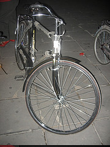

[{.center}](jingshang-park.jpg)

Yesterday was full-on tourist travel day. Summer Palace first thing in the morning. Then the Great Wall. Then lunch in an authentically exotic restaurant hard by the Chinese Ethnic Culture Park. Then the Forbidden City and finally Tiananmen Square. Nothing I could say about any of those places would be both good and original, so I won't bother. One thing I did notice though, was just how many pictures had been taken and geotagged at the Great Wall, Badaling. So here's a challenge to anyone out there with huge Flickr and Geo Fu. How about scanning the entire world in, say, 10 km squares to find the most photographed (and geotagged and uploaded) places on Earth? Neat. Maybe it could even be done with a Yahoo Pipe.

{.center} 

Anyway, that was yesterday, and all lots of ticks. The day before, however, was something special. I'd found, thanks to an ex-colleague who now lives in Beijing, the rather fine [Chinese Culture Club,](https://web.archive.org/web/20070929074829/http://chinesecultureclub.org/) and through them booked a cycling tour of the hutongs of Dongcheng and Xicheng. The tour promised a ride through the narrow alleys of the hutongs, a boat trip on Houhai Lake and dinner with a family. It totally lived up to its promise. The Drum Tower gave us a great view over that part of the city, aside from being interesting all on its own. There was an ancient water clock -- probably a modern repro, but never mind -- that had a series of cisterns through which the water flowed, which I suppose compensates for pressure variation as the amount of water in the top drains out, and a ruler that floats on the surface of the lowest cistern, which indicates the time. Every quarter of an hour a mechanical mandarin clashes his little cymbals together. Altogether delightful.

Then we saddled up (more later) and took off through the alleyways. Fifteen fat tourists shepherded by a very nice man with the spanners and pumps and two young women with the English and the guide accreditation. That was a real treat, rolling along at a leisurely pace, able to take in the sights, sounds and smells, and able to stop for an occasional photograph, although not for too long. I have a gps track of where we went, but I don't have any way of visualizing it on this machine. I'll bet it looks a bit like a bowl of noodles.

As the light was fading we cycled up to a landing stage on Houhai Lake where two boats were waiting for us. We clambered aboard and were joined by a woman musician.  Jasmine and Erin, the guides, produced snacks (wasabi peanuts and sweet fried stuff, an oddly enthralling combination; also sweets made of hawthorn, or so we were led to believe) and water, and off we went. The musician produced her instrument, a [pipa](http://www.philmultic.com/pipa/), attached her plectra, and off she went as we were rowed, gondolier fashion, out onto the water. The sound was ethereal, and if I hadn't been sitting next to her I might have sworn it was a wind rather than a stringed instrument. Clouds streaked the sky in the west, the wasabi peanuts were tasty as all get out, the water was undisturbed save for the odd lone swimmer (one in a very fetching mauve swimming cap) and it was very blissy.

The only somewhat odd note (if I may be forgiven) was the nature of some of the tunes: Edelweiss? Step we gaily? Auld Lang Syne? Halfway through the proceedings a little motor launch appeared with another woman musician who hopped onto the other boat and proceeded to set up her [guzheng](http://www.philmultic.com/guzheng/index.html). The fingering was awfully complex, with one hand plucking notes while the other bent individual strings to provide weeping and wailing sounds. Sometimes both hands were plucking, and out there on the lake, with no amplification, the sound filled the twilight to the gunwales.

{.center} 

Could the evening get any better? And remember we'd been essentially cooped up in a grandish hotel since Monday night? Yes it could. Back on bikes, ten minutes ride away, we were ushered into the home of a very nice woman -- I regret I did not get her name -- who not only allowed us to use her toilet but also gave those who wanted a chance to make dumplings. Watching, it looked effortless. A quick couple of rolls on the little ball of dough, a smear of filling, and a neat sealing movement. But that's the thing about craft skills; they look easy because they've been practised to perfection. I think my rolling was up to scratch, but my sealing efforts were definitely not as neat as they should have been.

And then to dinner; home cooked, delicious, nothing too outlandish, and plenty of it. Afterwards, our hostess told us a little about her life since the opening up of China, and of how things were in the little courtyard houses that are so typical of the hutongs. She agreed that the modern high-rise apartments are better in many ways, and the young people prefer them, but they don't have the same sense of companionship as the old places, she said. And then, further news about the toilets. When the hutongs were built, not all that long ago, none had a private toilet. In return, there are many, many public toilets scattered through the streets. But with economic liberalization came a bourgeois desire for private sanitation. Only the pipes were of rather limited bore. "Only liquid waste in toilets," translated Jasmine the guide. "For solid, still have to go to public toilet, even in night, even in pyjama."

How we laughed, and then finished clearing the tables. Back onto the bikes to cycle back through even darker alleys to the Drum Tower and a taxi back to the hotel. It really was an educational, informative and entertaining evening.

{.left} Which is where I ought to leave the story. But honesty, or something, compels me to add that the bicycle was, without any shadow of a doubt, the most uncomfortable bicycle I have ever ridden in my entire life. When I was seven, I think, my mother hired a bicycle for me for the summer. This bike was similar. Sturdy frame, rod brakes, big wide sprung saddle, nice curvy handlebars. Except that it was simply awfully made. The brakes were pointless affectations. The saddle pitched and yawed alarmingly and the cover soon gave up any pretence of protecting one from the springs beneath. The first bit of pressure I put on the pedals promptly loosened one of the cotter pins, resulting in that pleasingly syncopated jerk so eerily familiar to cyclists who know about loose cotter pins, a punishment from cycling hell. And so on and so forth. If the evening hadn't been so fine aside from the bicycle, I would have been in very bad spirits indeed. As it was, the hideousness of the bike in some awful way added to the charm.

The Chinese Culture Club asks for feedback and suggestions. I suggest that they save up and find a way to invest in reasonably good bicycles that they own and maintain. These were clearly on loan and probably would be sold the following day as new. People will have a much better time on halfway decent bicycles, without having to dredge deep into buried childhood memories to make the best of it.

There are some more [photos here](https://www.flickr.com/search/?user_id=73529121%40N00&sort=date-taken-desc&text=Beijing&view_all=1)

! 2021-09-29: Chinese Culture Club is now [China Culture Center](https://web.archive.org/web/20210506074547/http://www.chinaculturecenter.org/). I guess they must have improved their bicycles.

