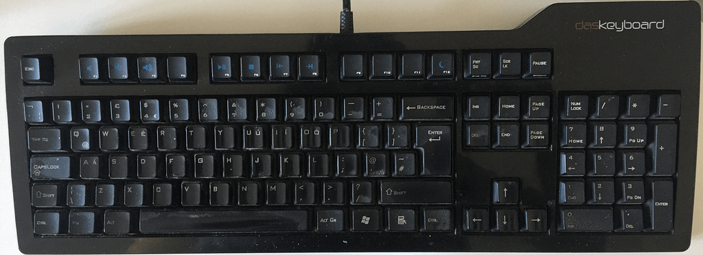
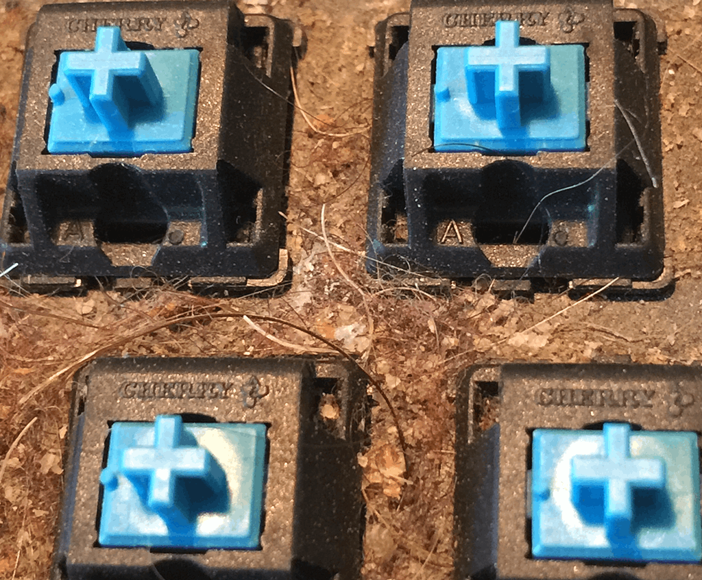
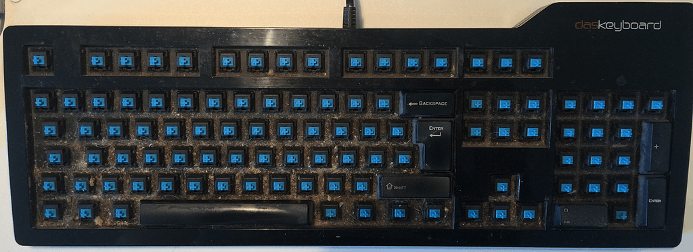
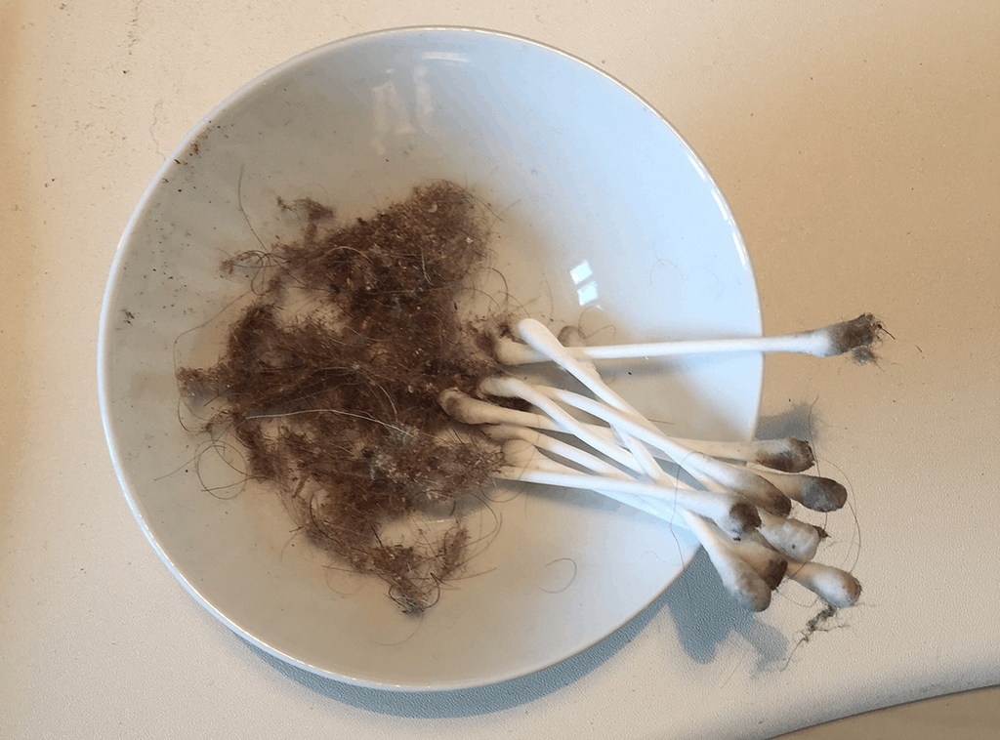
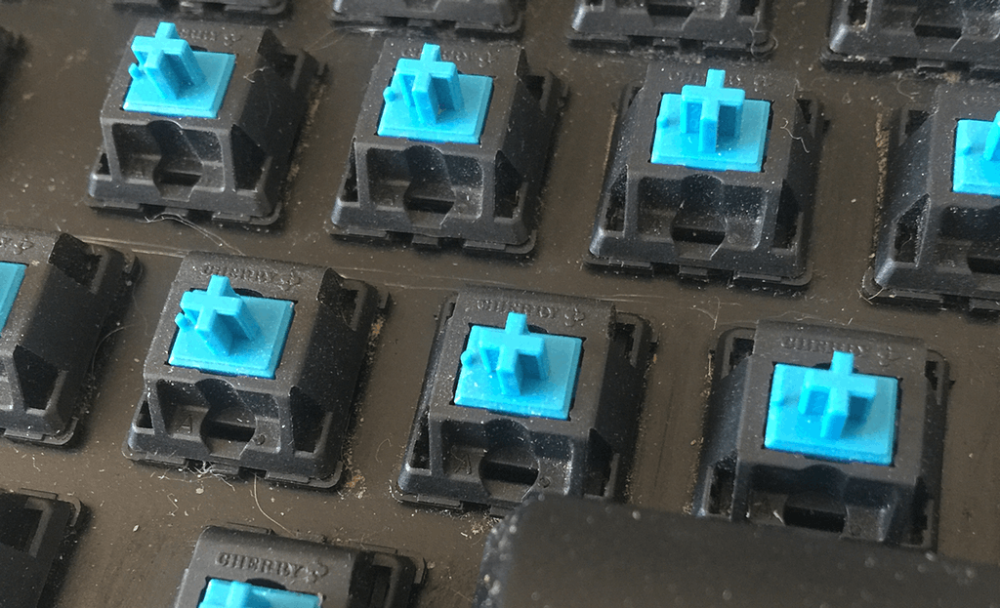
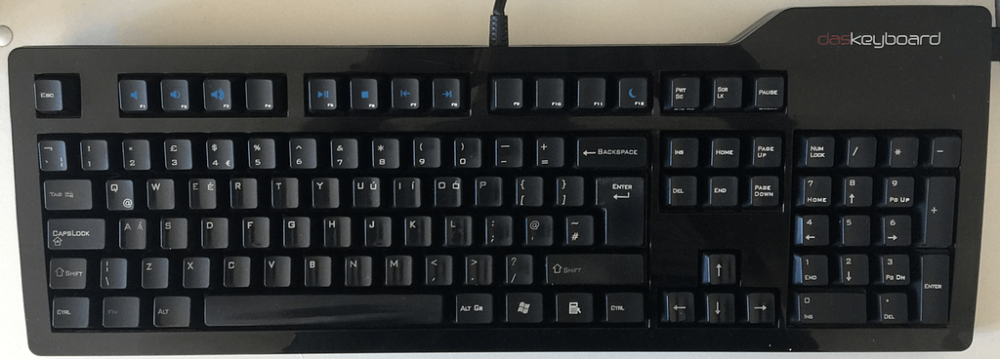

 

From time to time a key on my clickety-clack keyboard gets stuck and refuses to register. Usually, I just prise off the keycap, fiddle about with an unbent paperclip or something and hope for the best, but the last time it happened it was one of the letters I need for my password and it was a royal pain. Plus, I've been saying for weeks, if not months, that the keyboard deserved a jolly good seeing to. (I've had it [just over nine years](/blog/keyboard-love) now; it's the least I could do.) 

===

Yesterday, with no urgent work on the horizon, I took the plunge. I began, as one begins all such tasks, by watching a Youtube video. I won't bother linking, because the only important advice it offered was to use plain warm water as a solvent. Had it been damaged by coffee or something nastier, perhaps I might have needed isopropyl alcohol, but in fact warm water turned out to be fine.

So, I started off with photos of the keyboard as it is, more to help replace they keys when the time came than to immortalise its state. But why not?

{.center}

Once I had removed a couple of keys I was totally horrified. How had all that grunge accumulated. Luckily it takes a lot to disgust me.

{.center} 

I carried on removing keys, using an old credit card to lever them up. The big ones with the stabilisers I didn't even attempt, because really there weren't that many of them and how much grunge could hide there?

{.center} 

With all the keys off it was a matter of carefully removing the accumulated cruft -- a mixture of dog hair, my hair and who knows what -- with a stiff brush and then, more carefully still, with a dampened Q-tip. There was a lot of it.

{.center} 

{.center}  

I rinsed the keycaps in warm water for a while and then scrubbed at them with an old toothbrush. The water here is very hard indeed, so I thought it would be worth rinsing them in de-ionised water before setting them out to dry. I also used damp Q-tips to clean the keys I had not removed and the case. And then, a couple of hours later when I judged the keycaps to be dry enough, I consulted the photos and replaced all the keycaps. The only difficulty was the inverted-T arrow keys, which took a bit of juggling (before clicking them back on) to get right.

{.center}

I won't say it is as good as new. But it is jolly spiffy again, and after a day well spent it feels very satisfying to have finally given it the TLC it deserves. And, just as I said nine years ago, I now feel more motivated to invest a little time in creating some more useful keyboard shortcuts. Any suggestions?