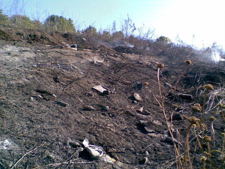

{.center}

Someone must have dropped a cigarette down by the river a couple of days ago. Or maybe they were cooking up their dope and things got careless. Either way, the place was a smoking wreck yesterday morning. I’d love to inventory the crap the plants hide. No, actually, I wouldn’t. Sometimes I dream of allotments down there by the river. But given how people treat their surroundings, it wouldn’t last long unless one slept down there loaded for bear and with a Rottweiler for company.
