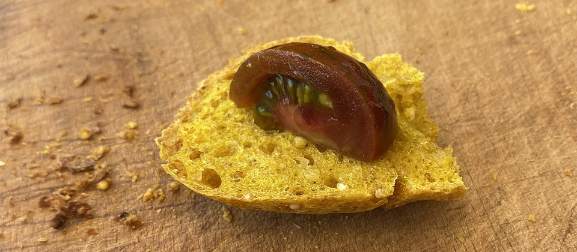

My online chum Lewis Coles has, like everybody and their dog, been baking bread in these troubled times, and <a class="u-in-reply-to" href="https://www.lewiscowles.co.uk/blog/bread-as-code/" >he’s not happy</a >.

Lewis is a software engineer. I can’t be sure, but I guess that he thinks that if you follow a set of instructions, you should end up with the same result every time. So he’s understandably peeved. 

===

“Why the hell are the instructions to make bread, so poor,” he asks, preceded, of course, by “Of course I’m not serious, but …”

I take his point. Judging by the questions that come up in the bread forums I frequent, many of the instructions going around clearly are pretty poor. And, Lord knows, I’ve had my share of [disastrous errors in instructions](https://www.fornacalia.com/2014/in-which-a-croissant-recipe-makes-me-cross/) going [way back](https://www.jeremycherfas.net/blog/dan-lepard-s-black-pepper-rye). But there are also some fundamental misconceptions in Lewis’ approach.[^1]

[^1]: As there are with people who think of DNA as code, but that’s a giant subject I am unlikely ever to tackle.

For a start, I’m dead against the idea of muscle memory as a guide. Consistent output requires consistent input, in bread as in code. You need to weigh the ingredients, not eyeball them, just as I need to remember to tell my code that, despite appearances, `”this is a single word”`.

Even then, there may well be differences in the ingredients that are essentially invisible; the protein content of the flour, humidity, temperature, the state of the leavening, all sorts of things. That’s why, even with weighed inputs, you watch the dough, not the clock.

I’m not a good enough coder to think of an obvious analogy. Maybe something like not assuming that if you try to do a certain thing to a file, it will always work, but testing to see whether it has worked before moving on.

In bread, as in code, that takes experience. For bread, it requires baking the same basic bread quite a few times in a row and adjusting one thing at a time.

[{.center}](sandwich-1920.jpg)

I realise this is all in fun, and that’s the spirit in which I am engaging, something I said I would do three weeks ago, to my shame. I applaud anyone who learns to bake bread, and try to help as a thing I can do in exchange for the help I have had with code. In that spirit, to anyone who wants to improve their skill:

* Get a decent balance and weigh your ingredients
* A thermomenter is handy too, for the dough and for the oven
* Pick a recipe and stick with it for a few iterations
* Change one variable at a time
* Continue to have fun
* Trust instructions, but verify. 
 
Some instructions are written for people who already know what they’re doing, others try to suit complete beginners, and they’re the most difficult ones to get right, because each beginner’s problems are unique. If I assume I’m writing for someone who knows how to bake, as I was [this morning](https://www.fornacalia.com/2020/turmeric-breadan-experiment/), it is much, much easier to tell them what to do. Just as it is for Lewis when he assumes I know what I’m doing with code.

Happy to answer questions about bread. Happy to ask them about code.
