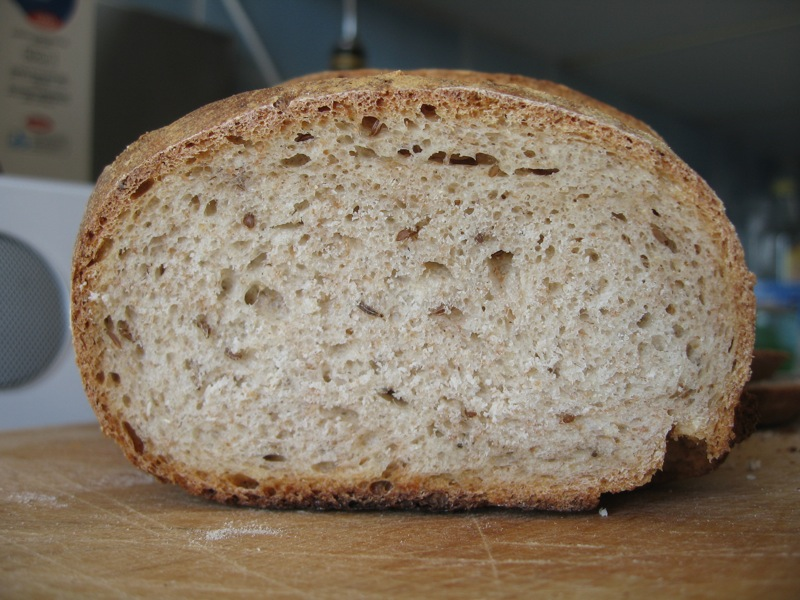
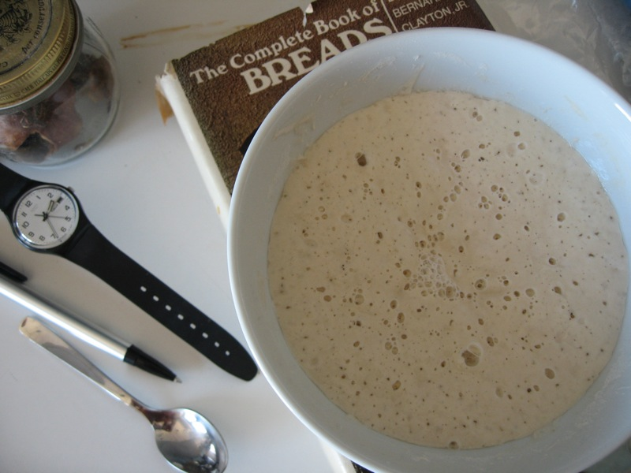
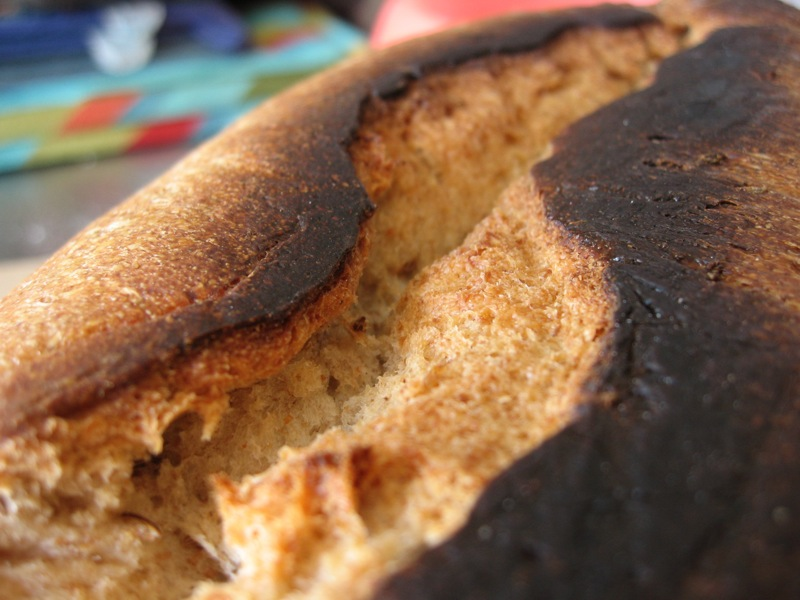

Hey, it’s [Lammas Day](http://www.sustainweb.org/realbread/local_loaves_lammas/), time to celebrate with a loaf of the season’s freshly-milled wheat. Failing that, and ignoring all the woo-hoo that nowadays seems to surround even the simplest expression of gratitude, I’m going to mix traditions and post about my soul's search for a good Jewish rye recipe.

I've been hunting for a while for a reasonably light, caraway-loaded rye, a Jewish rye that I remember best from Lindy’s in north London. Yesterday I decided to try build on the Caraway Rye Bread recipe in Bernard Clayton Jr’s _The Complete Book of Breads_, using a natural leaven, Clayton’s quantities (roughly. I ignore most of his sugar and all of his fat) and some of the techniques I’ve picked up from Dan Lepard.

{.center}

The result was pretty good, for a first effort. The crumb was light but close, which is what I wanted. The crust was crunchy, maybe a little too crunchy. It needs a nice shiny glaze, just for looks. All in all, not a failure. But I am certain it can be improved. So the ingredients below are for reference only. I won’t be using the same quantities again (which makes it perhaps pointless to send this to [YeastSpotting](http://www.wildyeastblog.com/category/yeastspotting/). The method, though, is not likely to change too much.


## Ingredients

````
200 gm active white starter at 100% hydration
350 gm water
530 gm white flour. (I used a new one on me, the Coop's 00 organic, which according to its label contains 12.5% protein, the same as their Manitoba.)
220 gm whole rye flour
1 tbs demerara sugar (Clayton calls for 3 times this.)
15 gm salt
20 gm caraway seeds, toasted (Clayton calls for 2 tbs, 17 gm, but I really like caraway.)
````

## Method

{.center}

In a large bowl, add the water to the starter and stir to disperse the leaven. Add all the other ingredients -- white flour, sugar, salt and caraway seeds -- and stir to incorporate roughly. Tip the mass, which is still pretty dry, onto the work surface and try to bring it all together. This is not easy. The dough is dry (53% hydration if you use the full 530 gm of white flour) and doesn’t easily form a uniform paste. Caraway seeds fly out of it. Once it seems pretty much incorporated, form it into a ball and place it in a clean bowl, covered, to rest for 10 minutes. After 10 minutes, tip the dough out onto a lightly oiled work surface and knead quickly for 10 seconds, about 15 push, turn, folds. Return the dough to the bowl and repeat twice more.

By the second kneading the texture is already changing, becoming less dry and shaggy and more coherent, and by the third it is a reasonable-feeling dough. Return the dough to the bowl for 60 minutes, then divide the dough in two, shape each into a ball and leave to rest on the counter, covered by a cloth, for 10 minutes.

Shape the dough into a loaf and allow to proof, seam side up, on a flour-coated cloth. Mine proofed for about 2 hours; I don’t think it was enough.

Preheat the oven to 200℃ (the book says 400℉, which is 205℃, but c'mon; Gas Mark just above 7 will do), turn the loaves onto a baking tray, slash, spray and put in the oven. After 20 minutes, turn the loaves, and after 40 check for doneness. I look for an internal temperature of around 93℃. Cool on a rack.

## Lessons learned

{.center}

This dough is just too dry. That shows most in the way that the seams split during the final proof. I pinched them shut again, but they still opened up in the oven to create a rift valley along the bottom of the bread. Using 467 gm total water (including the water in the leaven) would increase hydration to 55%, which may be enough. I’ll try that next, or possibly go all the way to 60% and 510 gm total water. Perhaps just being moister would prevent the seams splitting open, or I might try a different shaping technique, patting the dough out into an oval, pressing a rolling pin down the long axis and just folding the two halves together before pinching all along the seam to seal.

It might also be worth gelatinizing the rye as Dan Lepard does in many recipes. A little of that, saved and thinned, would make a nice glaze too.

[More pictures here](http://www.flickr.com/photos/jcherfas/sets/72157624503340883/).
