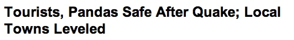

{.center}

That is a genuine screen-grab from a genuine web site of a genuinely major player. Your task, should you accept it, is to identify the player.

Of course, Google renders this utterly nugatory, so I’ll just say that the subs at [National Geographic](https://web.archive.org/web/20080520034730/http://news.nationalgeographic.com/news/2008/05/080514-wolong-quake.html) should stand up and take a massive collective bow. Thanks Luigi.
