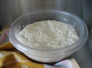
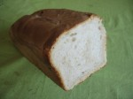

It felt very strange putting the bread in the fridge to rise, but I had to get to the bottom of this [new stickiness](https://jeremycherfas.net/blog/weird-bread/). The next morning it had indeed risen, quite a bit, but there was something odd and unexpected. A little rim of water around the edge of the dough. Ahah! Condensation!

I normally cover the bowl of proving dough with a plate. It’s simple, quick, and doesn’t get in the way, and I’ve always assumed it is plenty loose enough to allow the escape of any water vapour exhaled by my little helpers. What if it isn’t?

I tipped away as much of the water as I could -- it really wasn’t much -- brought the dough out of the fridge and covered it with a tea-towel.

Confound me for being an experimental fool and manipulating two variables at once!

That evening the dough had risen beautifully, although with patches of dryer skin ([Dishydrosis](https://en.wikipedia.org/wiki/Dishydrosis)! Yay! Sympathetic bread!) from its time in the fridge.

{.left} It was still very sticky though and I had to work it quite a bit, with a dough scraper and one hand, to get it into the loaf tin. Almost no extra flour though. It rose quickly, just 2.5 hours to double in bulk. And it baked beautifully.

{.left} So now I’m wondering. Is it condensation dripping from the plate back onto the rising dough that make the dough so sticky? Or something else related to the heat? I don’t think it can be the flour. The truly odd thing to get my head around is that I would have expected cool weather, when the plate is surely cooler than the dough, to create better conditions for condensation that hot.

So that’s the next experiment. Cover with tea-towel throughout.
