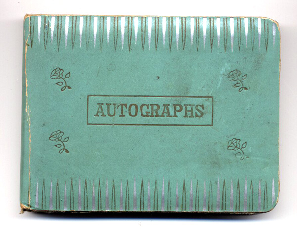

{.center}

Goaded, prompted, inspired by Dunstan Orchard's recent photoset on Flickr ([blogged](https://jeremycherfas.net/blog/secure-orchard/) earlier this morning) I decided to set to and scan a few pages from my own autograph book. They are [here](https://www.flickr.com/photos/73529121@N00/sets/714016/). But I'm still wondering whether a Flickr group is a good idea. Too nerdy?[^1]

By the way, Neddie, if you're reading this, I've put up the pages with the Beatles' signatures we got on a nightime escapade to Abbey Road studios, which I mentioned in a comment on your blog.

[^1]: 2021-08-06: Probably it was, but I [did it anyway](https://flickr.com/groups/69419871@N00/).
