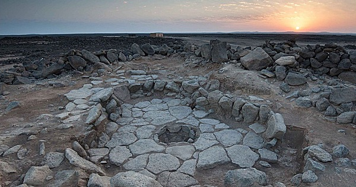

{.center}

Back in 2018, archaeologists celebrated the oldest crumbs of burnt toast in the world. But have you stopped to wonder how they found those crumbs? The bread they came from was a fine, mixed grain loaf that might well have been a special dish at a feast. It is even possible that **bread** was the first elite food that became affordable thanks to industrial technology — agriculture.

<a href="https://www.eatthispodcast.com/our-daily-bread-03/" rel=canonical>Listen to Crumbs; the oldest bread at Eat This Podcast.</a>
