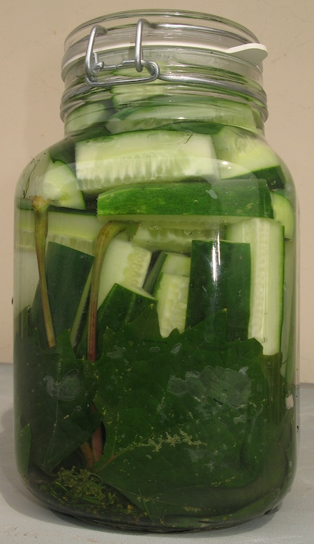
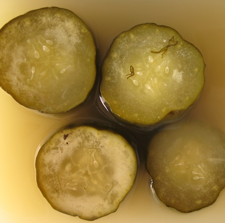

It all came together in the end. There was dill in the market, although just before we went away on hols so into the freezer it went. There were cucumbers aplenty when we got back, and some dry green chillies. A stroll around the neighbourhood produced the grape leaves (in lieu of the preferred cherry) and laurel. And garlic and peppercorns are never difficult.

So I stuffed the greenery into the bottom of a 2 litre preserving jar, added the [required amount of salt](https://jeremycherfas.net/blog/cucumbers-and-a-recipe-but-no-dill/), scrubbed and sliced the cucumbers, roundways, and packed them in too, and filled the jars with boiling water from the kettle. Less than 10 minutes work? The result, a beautiful jar of emerald cucumbers[^fn1] which then sat patiently on the shelf for a week.

{.center}

Each evening, I turned the jar upside down to distribute the stuff and eased open the seal. Even after a day, the dill garlic smell was wondrous. After two days, it was bubbling gently. After four days, I snuck a taste; very promising, and after a week, [fermented cucumber](https://jeremycherfas.net/blog/wrong-about-cucumber-pickles/) Nirvana.

{.center}

The cloves of garlic had turned blue, although in my excitement I forgot to photograph them. The sulphur-containing compounds that give garlic its pungency presumably reacted with copper in one of the other ingredients, probably the water. No matter; the pickles tasted sublime. Crisp enough, and juicy, and garlicky and the essential, indescribable dill. 

I made made another batch that same day, slicing longways and into quarters. Same story as before; just perfect. If anything, the fermentation was a little wilder on these. They might have been a bit mushy immediately out of the brine, but then seemed to crisp up a bit after a day or two.

I decanted the chunks into containers and submerged them with the fermenting brine and kept them in the fridge. They lasted fine, until they were gone, which was way too soon. About a week. Next batch I may try for a bit more chilli.

[^fn1]: The photo is actually of the second batch. 
