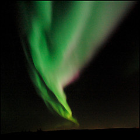

{.left} What a cool idea. Last week, on 28 September, the city of Reykjavik in Iceland doused all its street lights for half an hour to mark the opening of the Reykjavik International film Festival. So far so good, but better yet, while the lights were out a renowned astronomer talked about the stars and constellations on the radio.

===

The [organizers had said](http://www.cinematical.com/2006/10/01/the-night-the-lights-went-out-in-reykjavik/)[^1] that:

> "The twinkling stars and dancing streaks of northern lights can be just as good as quality festival films, and for that reason we want to begin the festival by setting our gaze upon the largest silver screen there is: the sky itself."

Alas, all was not entirely well. [Clouds spoiled the view](https://www.icelandreview.com/news/stars-blocked-clouds-as-reykjavik-goes-darker/), and some businesses and sports arenas failed to cooperate. I found this story at the web site[^2] of Andri Snær Magnason, the guy who had the original idea (via [High Earth Orbit](https://web.archive.org/web/20061101132251/highearthorbit.com/beautiful-sky/)). But I'm blowed if I can find a Permalink there, so don't blame me if the post is no longer up when you go to visit.

Wouldn't it be cool if Rome, or Venice, were to do this in future?

flickr photo by [eir@si](http://www.flickr.com/photos/eirasi/).

[^1]: *2019-11-13*: Defunct, as predicted.

[^2]: See 1.