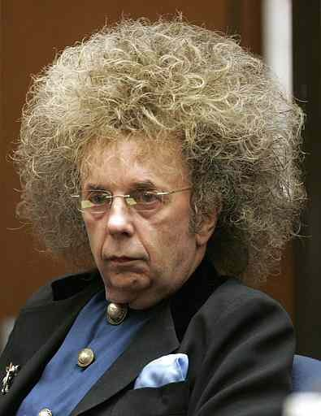

{.center}

Don’t let [this](https://web.archive.org/web/20071012023011/http://newcritics.com/blog1/2007/06/24/phil-spector-rock-and-rolls-norma-desmond/) happen to anyone **you** love. No matter how good they may once have been.

> Medicated to the gills, suffering from short man’s disease, thinning hair and a pathological need to be noticed, psychologically damaged from his father’s suicide, his mother’s coldness and his young son’s death and, oh yeah, armed to the teeth and surrounded by bodyguards, Spector is a walking WMD set to go off. It’s proof once again that fame and money can insulate you: Here is a guy who should have been involuntarily committed to rehab or extensive therapy years ago.

I heard the [NPR interview](https://www.npr.org/2007/06/05/10719192/author-interviewed-spector-weeks-before-shooting) with Mick Brown a couple of days ago, complete with excerpts from his interviews with Phil, and it was pretty chilling.
