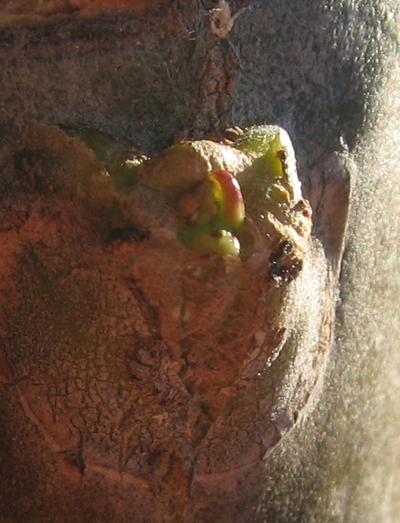

Almost a month after I [decapitated the magic frangipani](https://www.jeremycherfas.net/blog/desperate-measures), signs of life.

{.center}

Four or five of the axillary buds have swelled and given forth tiny little leaves.

{.center}

Is there enough time left for it to build up its reserves for another hard winter?
