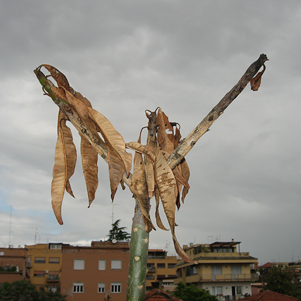
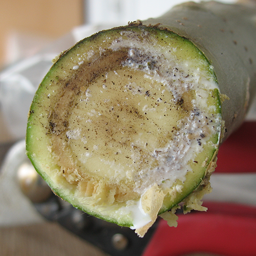
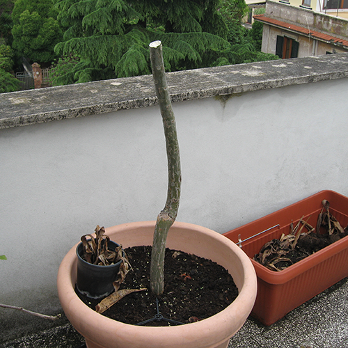

Long-time readers will doubtless be wondering what has become of my beloved [magic frangipani](https://www.jeremycherfas.net/search/query:frangipani). The news, alas, is not good.

{.center}

I noticed some time ago that it wasn’t flourishing. Some kind of soft rot seemed to be attacking the smaller shoots. I cut off the worst bits, and hoped that the rest would now sprout. But it has not, and this morning it was a sorry sight. And, hey, this is May; it should have leafed out. A quick Google revealed that there was indeed a [stem tip rot](https://ezinearticles.com/?Frangipani---Plumeria-Pests-and-Diseases&id=1853642) that attacks Plumeria, especially after a rough winter, which this certainly was. As with lots of these things, it is worth trying to cut back to an area of healthy wood. This I thought I had done, but the cut section still showed some nasty discolouration that I took to be the rot.

{.center}

I cut again, even lower down, and I think that we may now be in the clear. For good measure I stuck the amputated truncheon into some soil; nothing ventured ...

Now though, I need to hope that the plant breaks free of its stifling apical dominance and shoots. Quickly. Because it is not a pretty sight.

{.center}
