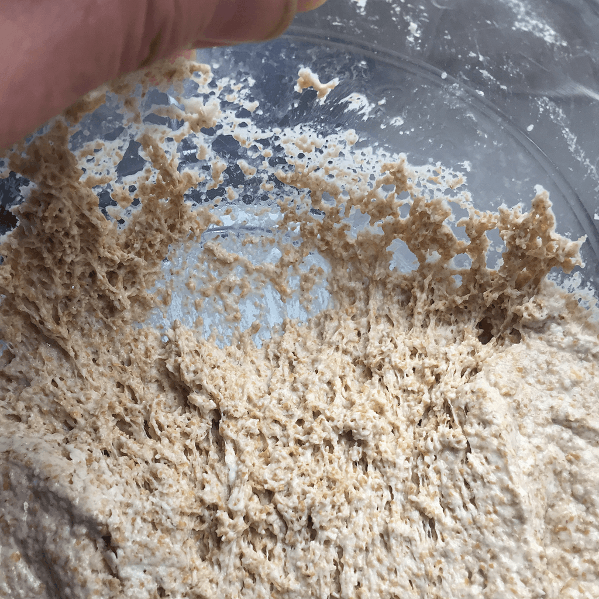

 

Later in the summer I'll be offering some [bread-making courses](https://www.fornacalia.com/i-can-teach-you-to-make-good-bread/), and as part of that I've been excavating part of my personal baking history. Today, that was the story of how I came by one of my sourdough starters, [the 100-year old Tuscan _pasta madre_](/blog/stories-to-savour). I snapped this portrait this morning.

{.center} 

A few observations:

- In the end, I don't think I did write much more about the class I attended. At least, I haven't found any later posts, but there are scads that I still need to bring in here.[^1]
- It pleases me that, having said there ought to be more pomp about handing over the _pasta madre_ to new caretakers, I started to do that in my own classes several years later without, I believe, having thought consciously about it.
- Is it right to refer to it as *my* starter? On the one hand, I was entrusted with its safekeeping, which I have done for almost a decade. On the other, by now the population has surely evolved from its state when I received it. On balance, I believe it is now mine, although I am also happy to share its history.

[^1]: At least I still have them to bring in here, thanks to being part of the IndieWeb before I knew that it existed.

