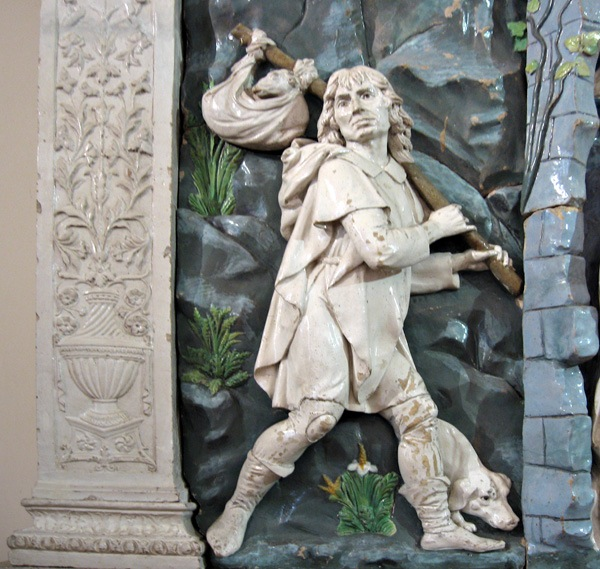

At the (workshop of) della Robbia Nativity, I’m brought up short by ignorance. It’s a wonderful object, the restricted colour range and the white of the main figures make it so much easier to read. I’m struck by the everyday acuity of the artist, and how that makes it real. Like, on that hunter’s leg, a hole in his stocking.

{.center}

“How amazing to show the hole like that,” I say to The Squeeze.

“But that’s [San Rocco](https://en.wikipedia.org/wiki/Saint_Roch),” she says, not missing a beat. “See his dog. He always has a wound on his leg.”

Right.

But the dog has no bun.
