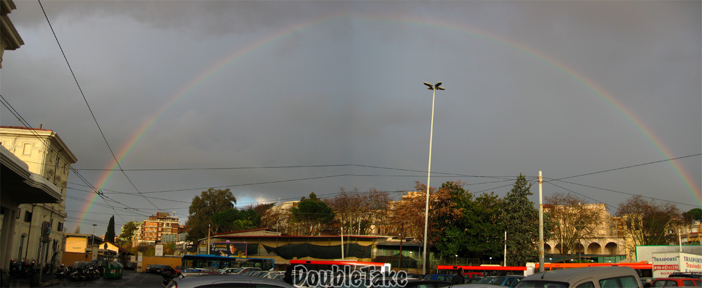

{.center}

Very odd. Flickr insists that “your blog posting failed”. But here it is anyway. I’m editing this in ecto, just to make life simpler. But the point of this post is to sing the praises of [DoubleTake](https://echoone.com/doubletake/), a beautiful Mac application that does one thing -- stitching panoramas -- really well.[^1]

[^1]: 2022-02-27: What a delight to discover that it exists still, and is clearly being maintained. I need to remember that when I am out with my “real” camera, although it is so very easy to just hosepipe with the iPhone.

I found it googling for Hugin, which I’ve used before and never really got to grips with. And I was doing that because the [Photoshop version](https://static.flickr.com/35/105382848_8797a82154.jpg) was pure pants. (Go and look if you don’t believe me.)

Hugin is probably vastly superior in some geeky image-stitching heaven and if life were longer maybe I would actually take the time to learn how to use it. But DoubleTake did such a superb job right out of the box (and let me know that I could adjust aspects of the individual images to make it even better, either inside DoubleTake or in some other program) that it will do, for now. I’ll register it soon, I promise.

Oh, and the picture ... a rainbow over Trastevere Station one morning last week, perhaps the only good moment in a pretty awful week, work-wise.
