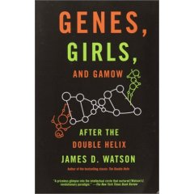

{.left} I said I had some more Jim Watson stories, and I do. But I’m not going to tell them here. Instead, I’ll mention just one little problem I discovered in his latest confessional: _Genes, Girls, and Gamow: After the Double Helix_.

A lot of people know that Watson’s homie Crick resigned his founding fellowship of Churchill College Cambridge when the college decided to build a chapel. Crick, bless, him, said he saw “no reason to perpetuate mistakes from the past”, and flounced off. What I didn’t know was that he sponsored an essay prize for the Cambridge Humanists,[^1] on “What shall be done with the college chapels?”. The winning essay, Watson says, “saw several different futures for them, including swimming pools”.

Now here is the truly appalling bit, the bit that naturally makes me doubt the veracity of all the rest of Jim’s unreliable memoir. He says that Crick “gave 75 guineas (£100)” for the prize.

This simply isn’t true. It cannot be true. Because, as any fule kno, 75 guineas is not £100 but £78 15s 0d, or £78.75 in new money.

Cue rant about today’s ignorant editors, don’t know they're born, wouldn’t know how to check a fact if their lives depended on it, no sense of history, blah, blah, blah.

[^1]: It isn't clear whether this was the [Cambridge Humanists](http://cambridge.humanist.org.uk/) or the [Cambridge University Atheist & Agnostic Society](https://www.cuaas.org.uk/), which changed its name “simply because most students didn’t know what ‘humanism’ is!” -- and that speaks volumes for slipping standards, cue another rant. (Links updated on 2022-03-19)
