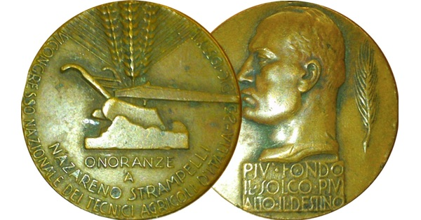

{.center}

Norman Borlaug created the wheats that created the Green Revolution. They had short stems that could carry heavy ears of wheat, engorged by loads of fertiliser. They were resistant to devastating rust diseases. And they were insensitive to daylength, meaning they could be grown almost anywhere.

All three traits had been bred into wheat 40 years before Borlaug got going, by the Italian pioneer Nazareno Strampelli.

<a href="https://www.eatthispodcast.com/our-daily-bread-10/" rel=canonical>Listen to Dwarf wheat: On the shoulders of a giant at Eat This Podcast.</a>