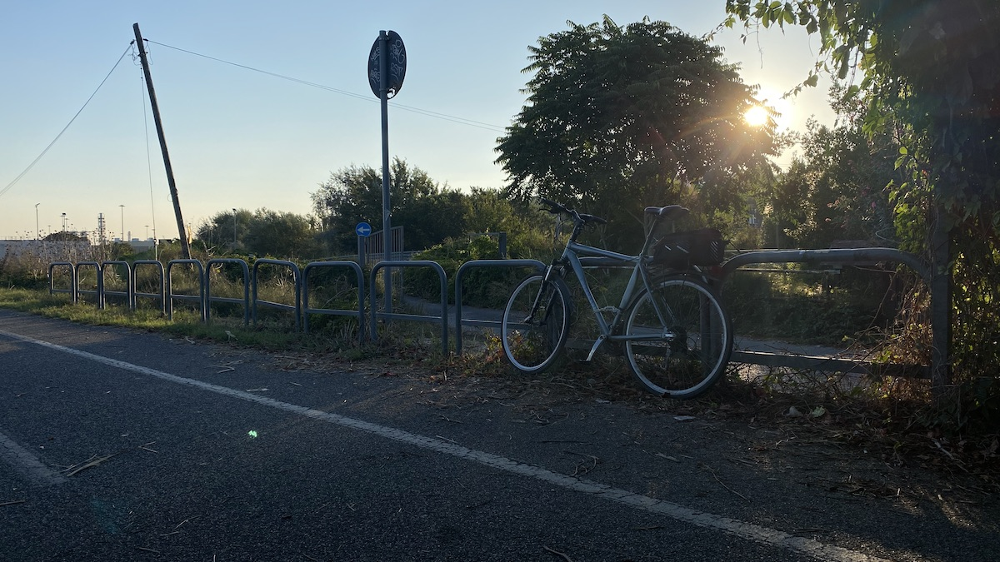

It has been beastly hot again lately, the kind of hot that washes out the afternoon almost completely. Any thought of taking exercise later in the day is quickly snuffed out, so last Sunday I woke at 6:00 and was out of the house and on my bike by 6:30 with only the one cup of tea inside me.

It was glorious.

===

{.center}

For a start, there was not a single idiot double parked, and very few idiots driving, which makes whizzing down the hill much more of a joy (even though I know it will be a pain to climb on the way back). The cycle path, which rises up from street level to skirt an area called La Magliana before crossing the river and then following the left bank of the Tiber downstream, was mercifully empty too. I saw just three cyclists coming the other way, one of whom returned my nod of recognition.

Soon after crossing the river you pass by a strange abandoned and ruined barn-like skeleton, and then round a wide bend the equally abandoned hippodrome of Tor di Valle. It closed about 10 years ago, with grand dreams and promises of a new stadium for AS Roma. Eight years later, [that idea was itself abandoned](https://www.goal.com/it/notizie/addio-al-progetto-dello-stadio-di-tor-di-valle-lannuncio/1r05h94j64n712rygt52n4vtx). What happens now is anybody’s guess.

Cycling past, two things struck me. One is that there are something like 700 “rooms” on the site. When I first started riding this bike path, horses still occupied a few but now all are empty. They don’t, yet, look to be in too bad a state and I just wonder what it would take to make them at least habitable for some of the many people who wash up on the Tiber’s banks. Too much, I suppose. The other is that all the large trees that shaded the site, at least those visible from the path, were dead. Coincidence? I think not.

{.center}

It is pretty amazing how quickly one finds oneself essentially out in the countryside. Of course there are ramshackle dwellings down by the river, some with chickens and goats scratching around, others seemingly growing rusted cars. But there are also open fields which in previous years have been sown to wheat. This year, large straw bales were the most obvious manifestation of farming, just by a large sewage works (41.82597384085056, 12.42249132290537).[^1] A little further on there’s a line of tall gum trees at the edge of the water works, and in their shade it actually felt a little bit cool, and the air was very pleasantly scented.

[^1]: A while ago I wrote a Shortcut, activated by asking Siri to “Drop a pin” that adds my location and time to a text file. It is very handy when you see something you might in future want to find on a map.

{.center}

The end of the road, as it were, comes soon after that, where the bike path goes under the Grande Raccordo Annulare, Rome’s ring road. The path continues, but I don’t. I stop for a rest and some cold water. The day is already beginning to heat up, though it is only 7:20 or thereabouts. On the way back, swallows (or swifts?) are lined up on a wire, some of them flitting about on a level with my head, a glorious distraction that made me even more thankful for the almost empty path.

By 8:15 I was home, having made it up the hill without too much sweat, thanks again to the lack of double-parked idiots, and with the whole day ahead and ready to fry my brains.

{.center}
