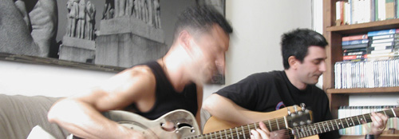

---
title: 'Easter Monday'
published: true
date: '04-04-2005 18:30'
taxonomy:
    category:
        - blog
    tag:
        - Glory
summary:
    enabled: '1'
subhead: " "
header_image: '0'
--- 
{.center} 

When I were a lad the back cover of every comic book was a window onto a world of strangeness. Sea Monkeys! X-ray Specs! Become a Cartoonist! And, of course, Play Guitar, Be Popular!

That last one was brought home with a vengeance last Monday afternoon. Sparing you the edible details (the sausages, the two-inch thick Chianina steaks, the wonderful salads and olives and bread and oven-baked, rosemary-strewn potatoes) because I don't want to seem too Italian, I'll cut to the chase. After lunch this bloke (and I'd send you to his [web site](http://www.google.com/search?hl=en&c2coff=1&client=safari&rls=en-us&q=alex+britti&spell=1) but it hijacked my browser and I'm not going to be responsible for that) started playing an old National Steel (or reasonable facsimile thereof). It was, simply, spell-binding.

That kind of talent is admirable and wonderful from afar. In a friend's living room it is simply jaw-dropping. Two guitarists. One very definitely in charge of the fireworks, the other providing the night sky against which they exploded. They'd start a tune, go through the changes once or twice, and then they'd be off, chasing it every which way until finally it came back to earth. Then do it all over again. More exhilarating than a cold shower.

I had to go home to do some very urgent work. But I learned later that the whole caravan shifted to the basement studio in his house and carried on from there. Rats!

I realise now that the opening to this post was very definitely influenced by that last book I read, [The Amazing Adventures of Kavalier and Clay](http://www.amazon.com/exec/obidos/ASIN/0312282990/qid=1112646602/sr=2-1/ref=pd_bbs_b_2_1/002-5008135-4931229). I haven't enjoyed a read as much in a very long time.
