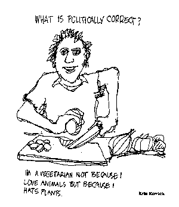

{.center} 

There’s an awful lot of tosh being talked about animals on farms and in diets these days. Militant vegetarians and vegans leaped on the recent FAO report to suggest that all we need to do to halt climate change is get rid of farm animals. Al Gore, [they said](https://freerepublic.com/focus/f-news/1796318/posts),[^1] can’t be committed to fighting global warming unless he “kicks his meat habit immediately”. Less prominently, a Daily Kos correspondent [said](https://www.dailykos.com/stories/2007/3/18/313119/-) that she had stopped eating meat after “a co-worker described how her husband was going to slaughter their pet pig for a family dinner”. The Gore business we can dismiss without further thought, but janierunaway’s decision deserves some attention.

[^1]: 2022-03-21: Original is long since dead, but [Free Republic](https://freerepublic.com/focus/f-news/1796318/posts) noted it too.

Animals play an absolutely crucial role in agriculture and farming. They eat the stuff we can’t, or won’t, and turn it into stuff we can, and will. On wet hillsides, what grows best is grass (especially if it is grazed, but that’s another story). Humans don’t cope well with grass. But they do pretty well on mutton and lamb and beef and cheese and even a drop or two of milk from time to time. So what are you going to do if you live in an area not suited for arable farming, and yet you want to eat locally? Pigs turn acorns and other inedibles into prosciutto and much else besides. I could go on, but you get the point.

People who give up meat for “environmental” or “ecological” reasons should be aware that what they are really objecting to, if I may put words into their mouths, is the current farming systems that makes a virtue of specialisation. On a mixed farm, in a mixed economy, animals are essential, and delicious.

The same goes for humane objections. It is only the demands of industrialised food that make slaughter the mess it usually is. Speedy lines do not engender respect for the animals. They jeopardise the safety of workers and eaters. But there is nothing inherently wrong with killing and eating animals.

In fact, I’d go so far as to turn janierunaway’s epiphany on its head. I eat as low on the food chain as I can, most of the time. And I like meat. But I’d far sooner eat someone’s pet pig than a factory-reared beast. People can give livestock the best possible lives and, when the time comes, a good death. They can feed their animals on waste (and I don’t mean rendered cattle or chicken feathers) and food we can’t eat, not on specifically grown crops that would be more than acceptable to humans. And they can have enough livestock to keep their farming systems efficient, rather than enough to satisfy the mythical hunger for meat.

All that means is giving up cheap meat. In a country like the US it may be easier to give up meat entirely, but I suspect that one would eventually have a greater impact by rewarding those who use animals appropriately.

As for the cartoon, used without permission, I clipped it from a forgotten magazine many years ago because it summed up my thoughts (on political correctness) so well. In deciding to use it here, I checked the author. Turns out [she was](https://web.archive.org/web/20061117193825/http://home.mindspring.com/%7Ekatrap/LAGAI/UVNov2001.htm#Kris) quite a person.
