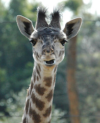

{.center}

I was at a zoo shindig last week, and one of my companions grew visibly excited by the announcement that a pregnant giraffe had just delivered herself of a little girafflette, all eyes and eyelashes and wobbly long legs. "How cute," she cooed. "I bet a lot of people will come and bring their kids to see it." The rational cynic in me couldn't possibly ignore such an open invitation to riff on the whole question of baby animals at the zoo, which, I now regret, quite took the wind out of her sails. I shouldn't have done it.

A few days later I read a report (on Fox News ~~http://www.foxnews.com/story/0,2933,290555,00.html~~ ), but there are other sources ~~http://www.iht.com/articles/ap/2007/07/23/europe/EU-GEN-Germany-Zoo-Killings.php~~, so it must be true) that workers at a zoo in eastern Germany had been fired for killing, and selling as meat, some of the animals. The zoo director lost his job and the workers may well be prosecuted, not because they killed the animals but because the animals "were shot and butchered without proper approval from a veterinarian".[^1]

[^1]: 2021-07-29: I know that I had seen the story at both of those links, but just in case you really want to know, here's the version from [Der Spiegel](https://www.spiegel.de/international/zeitgeist/feeding-time-zoo-employees-killed-animals-and-sold-the-meat-a-495419.html).

The two events cried out to be knitted together.

Back in the day I used to think and [write](http://www.amazon.com/gp/redirect.html%3FASIN=0563202815%26tag=ws%26lcode=xm2%26cID=2025%26ccmID=165953%26location=/o/ASIN/0563202815%253FSubscriptionId=02ZH6J1W0649DTNS6002) a lot about zoos. Nothing much has changed since then. Zoos still peddle the same old same old. Leave aside the ambassadorial idea, that animals in captivity can help educate visitors to the plight of their remaining relatives in the wild. Almost without exception zoos say that they exist to conserve wild animals, and one of the ways they do this is by breeding them in captivity. That can pose immense problems, getting animals to do the needful in an environment quite unlike the one  they grew up in. Success, though, is rewarded with increased visitors and kudos in the zoo world. And there have been many successes.

But as soon as the zoo has cracked the problem of captive breeding it faces another that is much more intractable. Surplus. For zoos, like ecosystems everywhere, are limited in their carrying capacity. There just are not enough resources to support all the offspring of a successful breeding programme. For a while they can distribute excess animals to other zoos eager to fill gaps in their collections. Space and cash soon run out. Then what?

Again, almost without exception, zoos say they will reintroduce animals to the wild. Some do, but successes here are much, much rarer; [california condors](https://web.archive.org/web/20070717092723/http://www.azgfd.gov/w_c/california_condor.shtml), [golden lion tamarins](https://web.archive.org/web/20110325233702/http://nationalzoo.si.edu/scbi/EndangeredSpecies/GLTProgram/InWild/Reintroduction.cfm), [black-footed ferrets](https://web.archive.org/web/20070607152943/http://blackfootedferret.org/timeline.html). Usually though the main thing that makes animals endangered is the loss of habitat, and until that is halted there is little point in worrying about reintroduction. The usual solution is quietly and with the minimum fuss and publicity to kill the extra animals, just an extension of the godlike powers zoos take for themselves.

The workers at Erfurt zoo were pioneering a new approach, although one not without precedent. In the revolution of 1848 the rabble demanded that the animals in the Paris zoo enjoy the same newly-won freedoms as the people, a sentiment that changed quickly when the ungrateful animals turned on their liberators. Later in the siege, the people were only too happy to eat the noble beasts. And there you have the perfect solution, if only zoos and the paying public had the courage of their convictions.

Let the animals breed. Let there be babies to draw the crowds, fresh babies every year. And let those babies later be slaughtered, with the proper approval of a veterinarian, to feed those same crowds at the zoos' cafeterias. Win-win-win, no?

! flickr photograph by [Saveena](http://www.flickr.com/photos/saveena/381369260/) used under a Creative Commons License.
