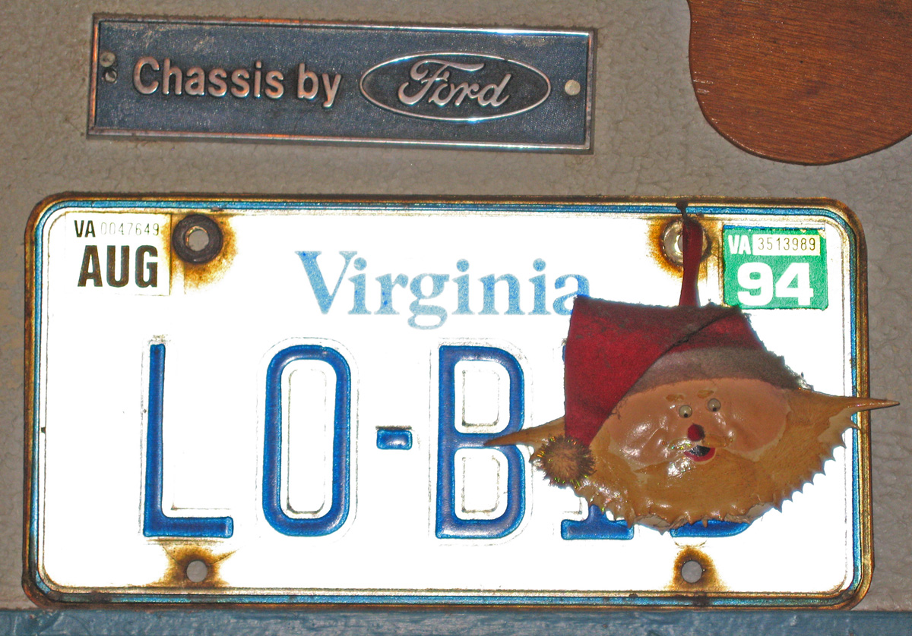
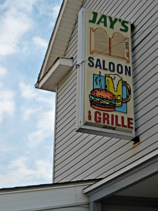

{.center}

It isn’t every day that a dried crab in a jaunty Santa hat looks down at one as one eats. It also is not every day that one gets the chance to make pilgrimage to a place that will, one day, be hallowed ground, fer shur. Let me explain.

===

I’ve been to some seminal musical experiences, public and private. I was at the Hammersmith Odeon back in ’64 when the Yardbirds opened for the Beatles. I was at the same venue some years later when a mob of Hawaiian-shirted fans were discomforted and confused by a black-clad Ry Cooder.  I encountered hot knives at the back of the Maple Leaf Gardens in the company of Bob Marley. And so on and so on. But I missed [the night the Harridans brought the house down] ~~http://corndoggerel.blogspot.com/2005/10/meet-harridans.html~~.

{.right} So when The Squeeze and I found ourselves at a loose and hungry end in Arlington, VA, round about lunch time on New Year’s Eve, there was only one place to seek: Jay’s Saloon and Grill. It wasn’t easy, 10th Street being a bit of a complex thing, but eventually we found it. Mecca. The crab watched as we wrapped ourselves around a tasty bowl of chili and a frosted mug of beer, to say nothing of a pile of fries smothered in unguents of a delicious nature.  There is something deeply satisfying about simple home cooking wherever one finds it, though I have to admit that while I could happily do lunch at an Italian hostaria every day, it would take arteries of steel to contend with Jay’s fare on a daily basis. Still, a little of what you fancy does you good, no doubt about it.

And how did I know to go there? [Neddie told me](http://byneddiejingo.blogspot.com/2005/10/it-is-to-be-enjoyed.html).

The miracle, looking about the place, was how they ever found space for a band, albeit only a three-piece, and the patrons to goad them on. We asked the bar-person. She seemed a little fazed by the question. “Well, they just set up kind of over here,” she explained with a vague wave of the hand. And we were none the wiser.

I love music, but I am deeply jealous of people who know music. Maybe that’s why I am so enjoying the drubbing that Neddie is busy handing out to [know-nothing noodleheads](http://byneddiejingo.blogspot.com/2006/01/when-its-done-and-over-lord-man-is.html). And I don't mean Pastafarians.

I try not to do regret, but I wish I had been off the Strand in 1971 for Bob Marley Live at the Lyceum. And I wish I had been at Jay’s in late October 2005. Still, at least I have been at Jay’s.
