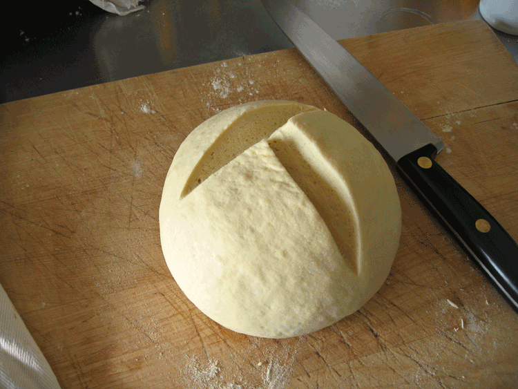
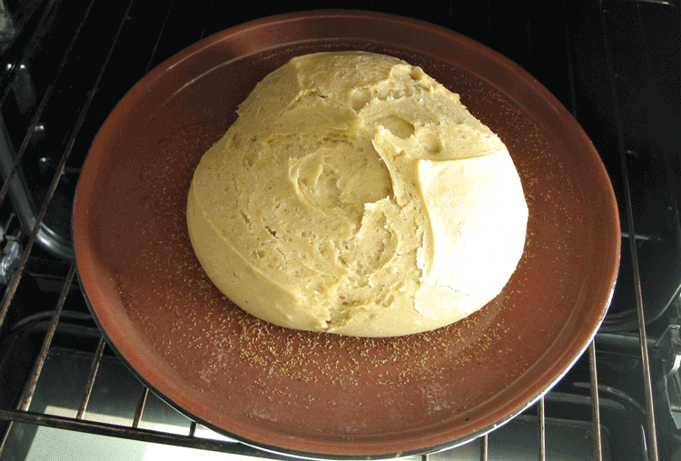
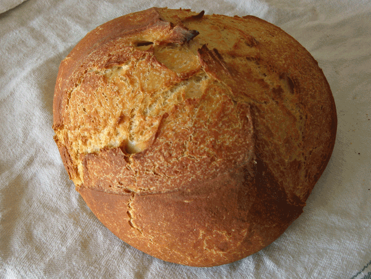
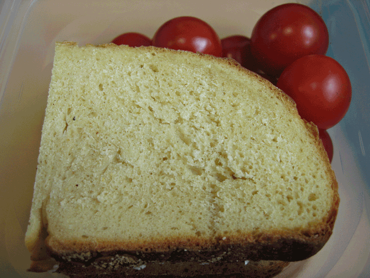

I was reading Elizabeth David's _English Bread and Yeast Cookery_ in search of the straight dope on Lardy Cake, which I've promised expat friends for a forthcoming English Tea. Having found what I needed, I decided to treat myself to rereading her consummate explanation of the perfect English Cottage Loaf, and how to make it. And there I discovered a lengthy passage, prompted by the recollections of Virginia Woolf's cook Louie Mayer, pointing out both that [Woolf herself was a great baker](http://johnbakersblog.co.uk/my-bread-virginia-woolf/) (who knew?) and that she started her bread in a cold oven and baked it under a pot, to create a hot and steamy atmosphere during the first half of the bake.

===

David is sufficiently positive that I decided to give it a go. I fancied an English-type bread again anyway, but a cottage loaf was just a bit too fiddly, so I decided to make a cob, or Coburg. I just followed David's instructions, which were a teeny bit odd.

For a start, there's a rest period of an hour and a half **with the yeast added**. So it's kind of an autolysis, except that I always thought that an autolysis was only done **before** adding the leavening. Then you knock the dough back violently three or four times before kneading and shape immediately after kneading. So it rises for a second time after shaping, for about 45 minutes. At this stage the dough was really satin smooth and much more elastic than the breads I've been making lately, and it had a sweet yeasty smell too, more pronounced than with a levain, even though I used barely 3.5 gms dried yeast to 400 gm flour.

{.center}

In the cold-start section, she advises under-proofing the loaves if you plan to bake from cold, which suited me fine. She says, "if necessary, re-shape the loaf". I did, just compacting it a bit by tucking the edges underneath. Then I popped the loaf onto a terracotta plate, did the three knife cuts, as advised, covered the whole thing with a giant casserole and stuck it in the cold oven. Lit it, set to gas mark 8 which takes it up to about 220℃ and retired nervously to the office with a timer.

{.center}

After 10 minutes, something was smelling awfully good, but the temperature was only 95℃. By 20 minutes, when I peeked, the temperature was 205℃ and the loaf was well risen and pale gold. At 35 minutes I removed the cloche. The temperature was 225℃ and the bottom seemed to be browning, so I reduced the temperature a little bit and left the loaf for another 15 minutes. That's probably 10 minutes longer than starting in a pre-heated oven, so the fuel-saving aspect of the procedure is moot, but the simplicity and straightforwardness of the approach is a great recommendation.

{.center}

And the bread? Delicious! The crust was crispy and crunchy and the crumb was fine and moist. I'd forgotten about a normal, regular crumb, in my pursuit of a good, holey, artisanal bread. It's a nice change, neither one being intrinsically better than the other.

{.center}

Of course, having discovered the method in Elizabeth David,  and having tried it to my total satisfaction, I went looking elsewhere, and discovered both cold-start and cloche baking all over the place. But that's OK.