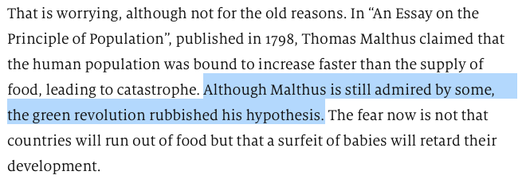

I freely confess that I have a thing about Malthus, and that thing is mostly to defend him from people with an extremely [narrow view of time](https://www.jeremycherfas.net/blog/like-fishwives-we-are-arguing-from-different-premises) and a profound [ignorance of biology](https://www.jeremycherfas.net/blog/picking-nits-is-part-of-the-good-life). The sad truth is that economists, as a generalisation, manage to ring both bells at once.

So it is with The Economist. In an otherwise sensible [article about demography in sub-Saharan Africa](https://www.economist.com/middle-east-and-africa/2018/09/22/africas-high-birth-rate-is-keeping-the-continent-poor) is a gratuitous and throughly mistaken sideswipe.

{.center} 

I've highlighted it to make life easier.

What does it mean to say that the green revolution "rubbished" Malthus' hypothesis? Is reproduction somehow no longer exponential, albeit with an exponent of 0? Is agriculture suddenly freed from the need to intercept light? 

So much tosh and, as I say, utterly irrelevant to the story, in which it serves only to deny that food is a pressing problem in Africa (and elsewhere). More tosh.