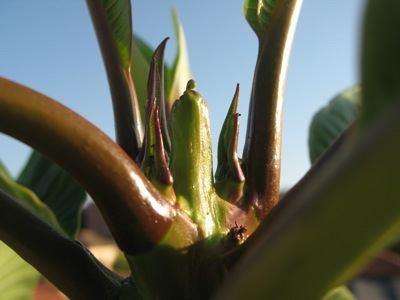

... if you like your excitement slow and gradual. So slow and gradual, in fact, that it has taken a week to get round to recording it.

Back [in April I recorded](http://jeremycherfas.net/2009/04/12/on-the-terrace/) that the magic frangipani’s leaves had started to stir around 21 March. Boasting about this with Simon the Gardener, who has forgotten more about plants than I’ll ever know, I commented that it looked a bit silly out of bloom, just a mop on the end of a stick. Oh yes, he said, Plumerias are well known for the strength of their apical dominance, and I briefly wondered about cutting the tip off to encourage it to break from lower down, but we quickly agreed that would be A Bad Thing.

{.center}

Then, a week ago, in my quasi-patient early-morning quest for flower buds, I noticed teeny-tiny axillary shoots, see above. They’ve come on great guns since then, and there’s even a really tiny shoot a couple of leaves down from the tip. That is exciting!

Still no sign of flower buds though.
